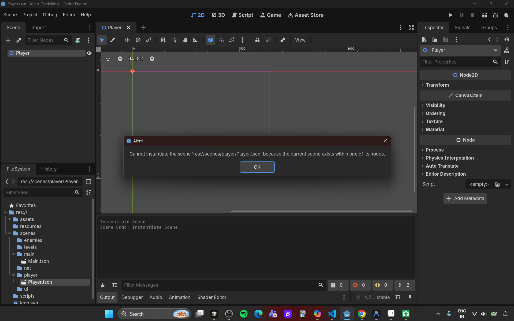
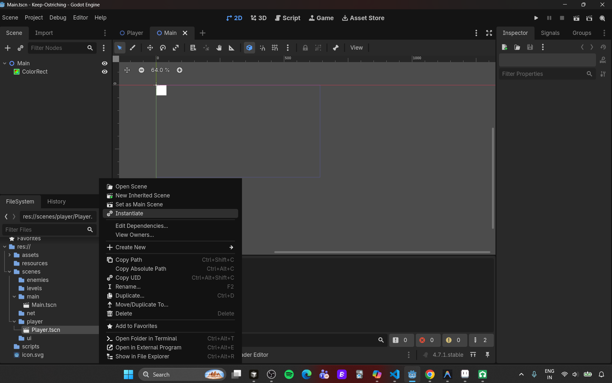
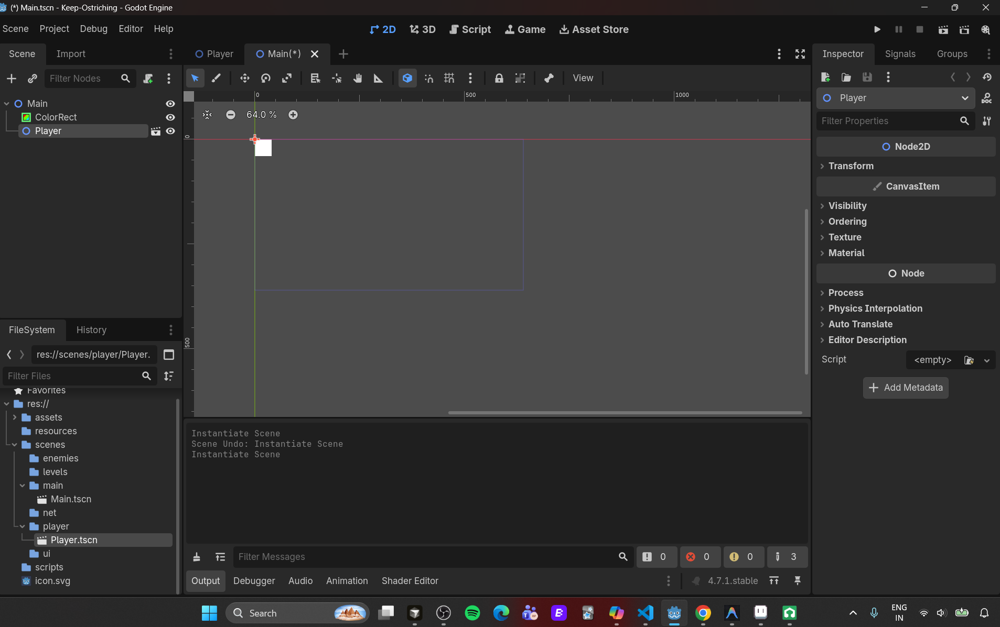
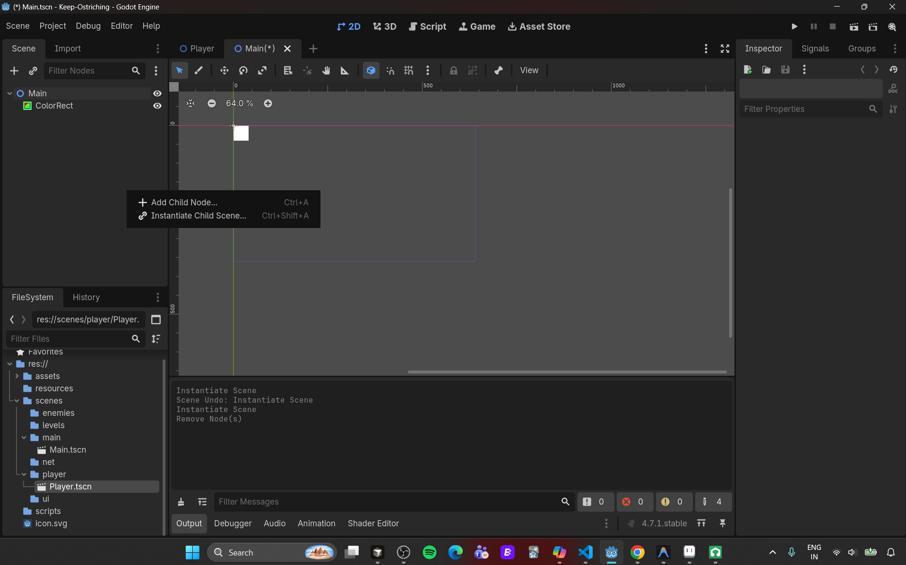
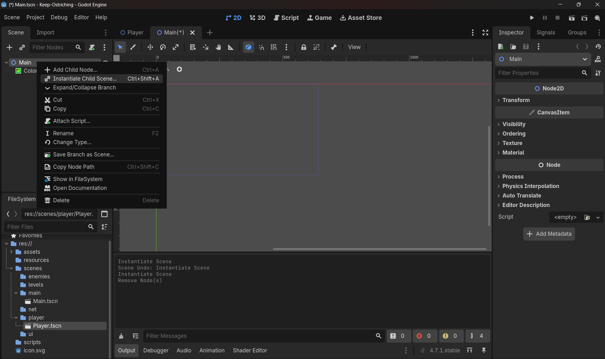
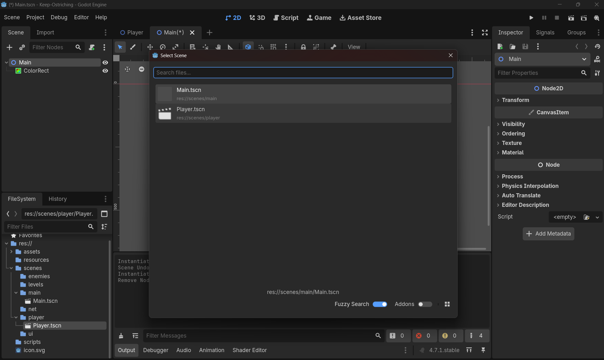

# Scene Reusability & Instancing (editor way)

> **Source:** Day4/1_doubts.md (Doubts 1–2)  
> **Plan day:** Day 2

---

# Doubt 1: Scene Reusability & Instancing

**Doubt 1 — separate scene vs nested in Main:** Build `Player.tscn` as its own standalone scene file, not as nodes buried inside `Main.tscn`. A separate scene file is a reusable blueprint — you can drop copies of it anywhere, test it in isolation, and (critically) Day 5's local co-op and Day 10's networked spawning both depend on `Player` existing as its own `.tscn` file to instance from.

**Follow-up — does instancing multiply copies automatically:** No. Instancing means "create one node tree from this blueprint," and it only ever creates **one** instance per call. Godot never auto-generates extra copies for you — if you want 2 players, you instance `Player.tscn` twice, manually. The one exception that *looks* automatic is `MultiplayerSpawner` (Day 10), which just calls that same "instance it" step for you every time a new peer connects — still one instance per trigger, not a batch.

**Net takeaway:** separate scene files exist so instancing is *cheap and repeatable*, not so it happens *automatically*. You'll always be the one deciding how many instances to create and when.


# Doubt 2 : Instantiate

```
Open any scene for eg, Main.tscn --> Right click other scenes not Main itself for eg, Player.tscn --> click on instantiate --> Now, Player scene has been instantiated under Main scene
```
## Note:
- If you try to instantiate the Main scene to itself a error will be thrown as below:
    - Error: 
- Meaning: This error means you tried to instance a scene inside itself. In your case, Player.tscn is already the root scene, and you attempted to add another Player.tscn as a child of the Player node. Godot blocks this because it would create an infinite recursive loop. 
- If you try to add that same scene as a child of itself, Godot would have to keep nesting Player.tscn inside Player.tscn forever.

## There are two ways to instantiate a child scene or any scene:
### 1, From FileSystem:
- So, here you open/click any scene you want to get a instance for eg main scene, right click on any other child scene click on instantiate.
    - Visual: 
    - After look in NodeDock: 
### 2, from Node Dock itself:
- So, in filesystem dock click on the main scene(Whichever scene wanna have instance or child scene), right click in NodeDock or right click on main node --> Click on Instantiate child scene --> A window opens --> select whichever scene except itself, for more info about error look above!
- Right click on dock: 
- Right click on main node: 
- After right click, commom window: 

