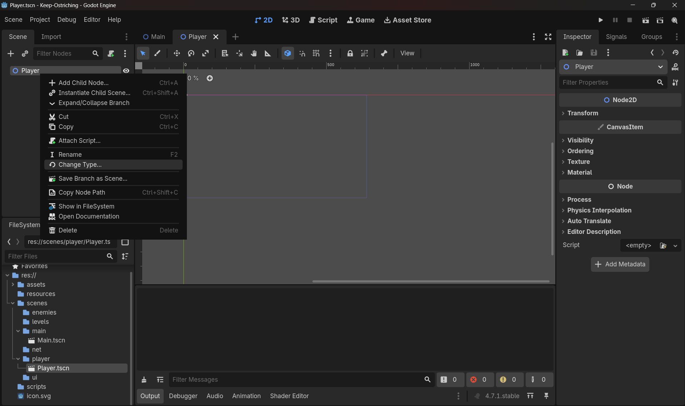
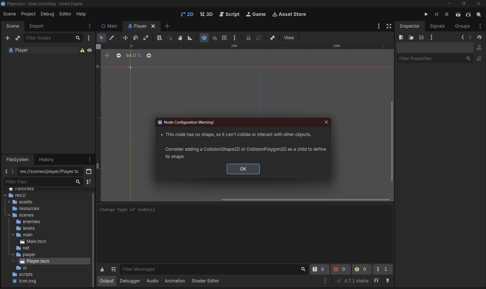
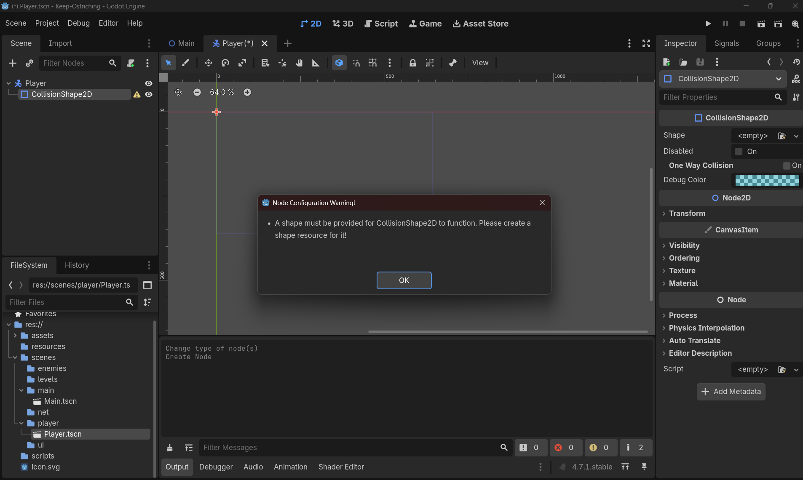
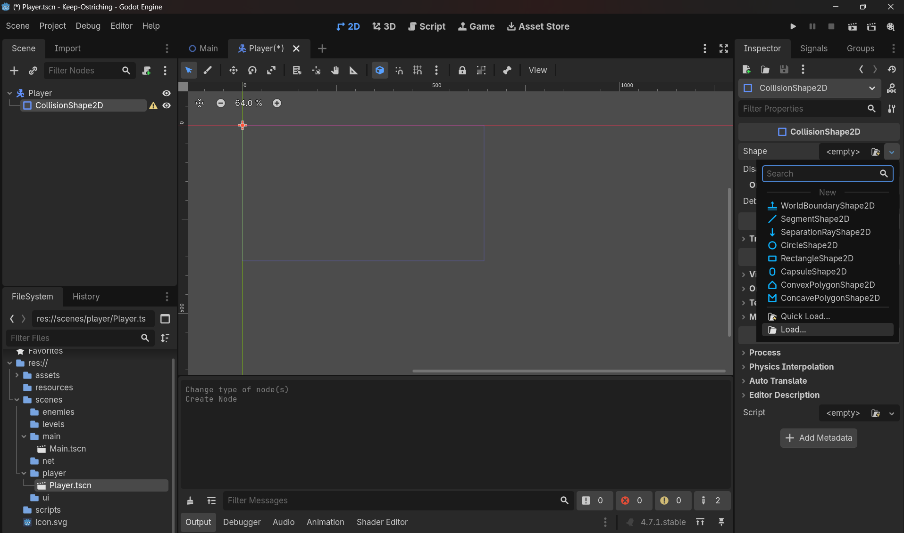

# CharacterBody2D, CollisionShape2D, ColorRect & Resources

> **Source:** Day4/1_doubts.md (Doubt 4)  
> **Plan day:** Day 2

---

# Doubt 4: All about CharacterBody2D, CollisionShape2D & ColorRect
## 🎮 Notes — CharacterBody2D, CollisionShape2D, ColorRect

**`CharacterBody2D`**
- **What it is:** A specialized physics body node meant for characters you move *directly through code* — not through physics forces like gravity pulling a `RigidBody2D` around.
- **Key built-in property:** `velocity: Vector2` — you set this yourself in script; the node doesn't calculate it for you.
- **Key built-in method:** `move_and_slide()` — reads whatever you set `velocity` to, moves the body that amount (internally scaled by the physics delta), and handles collision response automatically — stopping or sliding along anything solid it hits, rather than passing through it.
- **What it does NOT do on its own:** it has no shape and no visual by default. It's just a "container" node that *can* move and collide — it needs children to define what it looks like and what it physically occupies.

**`CollisionShape2D`**
- **What it is:** A child node that defines the *physical boundary* the physics engine uses — this is what actually collides with walls, other bodies, etc.
- **Invisible at runtime** — you'll never see it in the actual game, only in the editor (as a colored outline) unless you turn on debug collision shapes.
- **Requires a Shape resource** — it doesn't do anything until you assign one (e.g. `RectangleShape2D`, `CircleShape2D`) via its Inspector "Shape" field. Without this, your `CharacterBody2D` has literally nothing to collide with — it'll pass through walls, other bodies, everything.

**`ColorRect`**
- **What it is:** A purely visual UI/2D node — a solid-colored rectangle, nothing more.
- **No collision, no physics involvement whatsoever.** It exists solely so you have *something visible* to look at while testing, before real art exists.
- **Origin point matters:** its `Position` is its **top-left corner**, not its center — unlike how you'd naturally think of a character's position as its center. This is why it needs an offset to visually align with a centered `CollisionShape2D`.

**Why all three work together**
`CharacterBody2D` is the "brain + mover," `CollisionShape2D` is "what physics sees," `ColorRect` is "what your eyes see." They're deliberately separate concerns — later you'll swap `ColorRect` out for `AnimatedSprite2D` (Day 12) without touching collision or movement logic at all, *because* they were never tangled together in the first place.

## ✅ Instructions — Build Player.tscn (no code, you do every step)

1. **Open `Player.tscn`** (double-click it in the FileSystem dock if it's not already open).

2. **Confirm the root node**: In the Scene dock, you should see `Player` as the root, of type `CharacterBody2D`. If not, that's step 0 you'd need to redo — but based on earlier, you've already got this.

3. **Add the CollisionShape2D**:
   - Right-click `Player` in the Scene dock → Add Child Node
   - Search for `CollisionShape2D`, select it, click Create
   - With `CollisionShape2D` selected, look at the Inspector panel → find the `Shape` property → click the dropdown next to it (currently `<empty>`) → choose "New RectangleShape2D"
   - Click into that new RectangleShape2D resource (click the shape icon/thumbnail) → set its `Size` to something like `32 x 32`

4. **Add the ColorRect**:
   - Right-click `Player` again → Add Child Node
   - Search for `ColorRect`, select it, click Create
   - In the Inspector, set its `Size` to match — `32 x 32`
   - Set its `Position` — since `ColorRect`'s origin is top-left (not center like the collision shape), set Position to `(-16, -16)` so it visually centers on the CollisionShape2D
   - Optional: pick a `Color` in the Inspector so it's not the default (usually white/black) — makes it easier to see

5. **Check alignment**: Look at the 2D viewport now — you should see a colored square, and if you select `CollisionShape2D`, its outline (dashed/colored border) should overlap exactly with the `ColorRect`. If they're offset from each other, fix the ColorRect's Position until they line up.

6. **Save the scene**: Ctrl+S.

## How to change the type of the node or main scene(Root node is aka scene)
- Look at the image: 
- When you don't add a collisionShape to the characterBody it shows the following error: 
- So, solution is just add collision to it as a child node of player.(Remember player is a characterBody2d node)
- Even after adding a collision it shows some what same error, that collisionbody2d requires a shape, rect , cirlce or so on.
- Look at the image: 
- How?, With `CollisionShape2D` selected, look at the Inspector panel → find the `Shape` property → click the dropdown next to it (currently `<empty>`) → choose "New RectangleShape2D",Click into that new RectangleShape2D resource (click the shape icon/thumbnail) → set its `Size` to something like `32 x 32`
- OR, If wanna make it custom like a 2d person, click on load from the image below: 
- Work isnt done yet, now u added shape but to make it visible for human eyes add colorRect node with size 32x from inspector,Set its `Position` — since `ColorRect`'s origin is top-left (not center like the collision shape), set Position to `(-16, -16)` so it visually centers on the CollisionShape2D
### Why `(-16, -16)` for the ColorRect's Position

**The core issue: two different nodes measure position from two different reference points.**

- `CollisionShape2D`'s shape (the `RectangleShape2D`) is defined **centered on its own origin**. So a 32×32 `RectangleShape2D` extends 16px in every direction from wherever `CollisionShape2D` sits — that's `CollisionShape2D`'s `Position` (usually `(0,0)`, right at the `Player` node's origin, since you likely didn't move it).

- `ColorRect`, on the other hand, draws itself **from its top-left corner**. If you set `ColorRect`'s `Position` to `(0,0)` with `Size = (32,32)`, it doesn't span from -16 to +16 like the collision shape does — it spans from `(0,0)` to `(32,32)`, entirely to the bottom-right of the origin.

**So without the offset**, your visible square and your invisible collision box would be sitting in completely different places — you'd *see* the rectangle in one spot, but the character would *collide* as if it were 16px up and to the left of what you see. Classic invisible-wall-feeling bug.

**The math behind `-16`:** you want the ColorRect's top-left corner to land at `(-16, -16)` so that, combined with its `32×32` size, it spans exactly from `(-16,-16)` to `(16,16)` — i.e., centered on the origin, same as the collision shape. That's just: `-(size / 2)` on both axes → `-(32/2) = -16`.

**General formula to remember** (you'll use this constantly): for any `ColorRect` (or later, any top-left-anchored visual) you want centered on a point, set:
```
Position = (-width/2, -height/2)
```

### What is a resource?
**What it is:** A `Resource` is Godot's base class for **data containers that aren't nodes** — think of it like a standalone data file (similar to a `.txt` or `.json`, but Godot-native and typed). It holds data (a shape's size, a texture's pixels, a script's code) and exists independently of any node in the scene tree — no position, not drawn, not processed on its own. A node just *points to* a Resource; it doesn't own it. `RectangleShape2D` (what you assigned to `CollisionShape2D`'s Shape property) is a Resource. So are `Texture2D` (images), `AudioStream` (sounds), `PackedScene` (a `.tscn` file itself), `Script` (your `.gd` files), animations, materials, fonts — a huge chunk of Godot is Resources under the hood.

**Why they exist — sharing without duplicating:** a single Resource can be assigned to *multiple* nodes at once, and they all reference the *same* underlying data. Change the file once, every node using it updates. Compare that to baking the same settings into each node individually, where you'd have to edit every copy by hand and risk them drifting out of sync.

**When you'd reach for one:**
- Any Inspector field showing "\<empty\>" with a dropdown offering "New \<Type\>" or "Load" is asking for a Resource — you've already done this with Shape.
- When data should be reusable across multiple nodes/instances (like a hitbox shared by every player).
- When you want a custom data structure (e.g. a future `PlayerStats` Resource for health/speed) that isn't tied to any one node.

---

### Practical: create and save a Resource properly

Right now your `RectangleShape2D` is likely **embedded** — created inline when you clicked "New RectangleShape2D," living invisibly inside `Player.tscn` itself rather than as its own file. Let's convert it into a real, reusable file:

1. Select `CollisionShape2D` in your Scene dock.
2. In the Inspector, find the **Shape** field — you'll see the `RectangleShape2D` as an expandable inline resource.
3. Click the resource's dropdown icon (not the expand arrow) → a context menu appears with "Edit", "Save As...", "Make Unique", etc. → click **Save As...**
4. If you don't already have one, create a `resources/` folder at your project root first (right-click FileSystem dock → New Folder).
5. In the save dialog, navigate to `res://resources/`, name it something descriptive like `player_hitbox.tres`, click Save.
6. Check the Shape field again — it should now show a file path (`player_hitbox.tres`) instead of an inline/embedded resource, and you'll see the file appear under `resources/` in the FileSystem dock.

**Why this matters for you specifically:** on Day 5, when Player 2 joins for local co-op, both players should share the same hitbox. Instead of manually recreating a `RectangleShape2D` and hoping the size numbers match exactly, you'd drag `player_hitbox.tres` from the FileSystem dock directly into Player 2's `CollisionShape2D` → Shape field. Both now point to the *same file* — resize one, both update, guaranteed to match.

**In code, this looks like:**
```gdscript
@export var hitbox_shape: RectangleShape2D  # assign player_hitbox.tres via Inspector
# or, when the path is fixed and known ahead of time:
var hitbox = preload("res://resources/player_hitbox.tres")
```
`preload()` loads at compile time (faster, and Godot flags a bad path immediately) — use it whenever you know the file path in advance, which is most of the time. `load()` reads from disk at runtime, useful when the path isn't known until the game is running (e.g. loading user-selected content).

