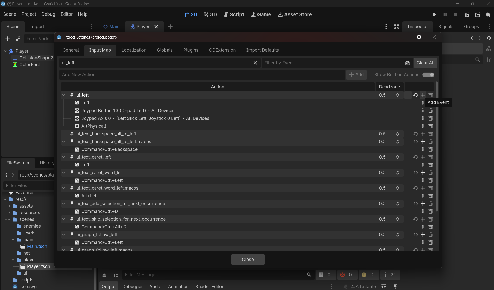

# Input Map Deep Dive

> **Source:** Day4/1_doubts.md (Doubt 5)  
> **Plan day:** Day 2

---

# Doubt 5: Input Map
## 🎮 Project Settings → Input Map — deep dive

**What it actually is:** a translation layer between "physical keys/buttons" and "named actions" your code refers to. Instead of your script checking "was the K key pressed," it checks "was the action called `ui_left` pressed" — and the Input Map is where you decide *which physical keys* trigger `ui_left`.

**Why this indirection matters:** if your code hardcoded actual key codes (`KEY_LEFT`), rebinding controls later (a settings menu, different keyboard layouts, gamepad support) means rewriting code. With named actions, you just change the *mapping* in Project Settings — zero code changes. Same principle as your `input_source` dictionary, one level up.

**What's already there by default:** Godot ships with `ui_left`, `ui_right`, `ui_up`, `ui_down`, `ui_accept`, etc. — pre-bound to arrow keys (and WASD isn't bound by default for these, only arrows + numpad, worth checking).

**Practical steps — go check this now:**
1. Project menu (top menu bar) → Project Settings → **Input Map** tab.
2. Find `ui_left` in the list, click the arrow to expand it — you'll see which keys are bound (should show something like "Left" for the arrow key icon).
3. Click image ref to add: 
4. **Do this today:** click the `+` icon next to `ui_left` to add another binding, press the `A` key when prompted, so both Left Arrow and A work. Repeat for `ui_right`→D, `ui_up`→W, `ui_down`→S. This isn't strictly required for the Ostrich to move, but WASD is the more common convention and you'll want it once Day 5 forces you to make room for Player 2's arrow keys.

You don't need custom `p1_left`/`p2_left` actions yet — that's Day 5's job specifically because two players can't both claim `ui_left`. Today, one player, default actions are fine (just widen them to include WASD).

---

## 📐 Quick math re-confirmation before you code

You already worked through: `direction = Vector2(get_axis("ui_left","ui_right"), get_axis("ui_up","ui_down"))`, then `velocity = direction * speed`, and `move_and_slide()` handles the delta multiplication internally. That's the full chain — nothing new here, just confirming it's locked in before you type it.

---

## Now — the actual script, written by you

Open `scripts/player.gd`. Using everything from today (GDScript syntax, `get_axis()`, `input_source` concept, `_physics_process`), write:

1. An `@export var speed` 
2. An `input_source` variable holding your chosen mapping (you decided this shape earlier — keep it consistent with what you designed)
3. A `_get_direction()` function that returns a `Vector2` built from `get_axis()` calls, pulling action names *from* `input_source`, not hardcoded inline
4. `_physics_process(delta)` that sets `velocity = _get_direction() * speed` and calls `move_and_slide()`

