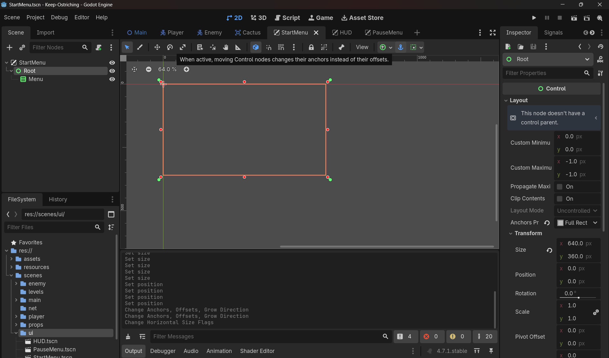

## 🔤 GDScript Notes

**`@onready` and node paths (`$Root/WaterBar`)** — `@onready var x = $Path` grabs a reference to a child node once the scene is ready, so you don't have to call `get_node()` manually every time you need it. The path is relative to the script's own node.

**Signals you declare yourself (`signal water_changed(...)`)** — same mechanism as the built-in `pressed` or `body_entered` you've already used, except now *you're* the one defining when it fires (`.emit(...)`) instead of Godot firing it for you.

**`typeof()` and `TYPE_DICTIONARY`** — a defensive check for "is this variable a dictionary (per-player) or a plain float (shared)." You may not need this if your Day 7 GDState already committed firmly to one shape — if so, delete the branching and just write the single-shape version, don't keep dead code around for a decision you already made.

**`Node.PROCESS_MODE_ALWAYS`** — the code-side equivalent of the Inspector's `Process Mode → Always` dropdown. Setting it in `_ready()` vs. the Inspector accomplishes the same thing; pick one so you don't have two sources of truth for it.

---

## 🎮 Godot Notes

**CanvasLayer + Control + widget hierarchy** — reminder from earlier: `CanvasLayer` gives screen-space rendering, `Control` gives anchor layout, `ProgressBar`/`Button`/`Label` are the actual widgets. Every scene below follows that same three-layer shape.

**Signal connection via the editor** — select the node → Node tab → find the signal → double-click → generates the callback stub in the attached script. This is how `_on_start_button_pressed()` and `_on_resume_button_pressed()` get created — you don't type the function signature by hand, the editor does, then you fill the body.

---

## 📐 Math Notes

`clamp(value, min, max)` in `apply_water_change` is the same clamp concept from Day 3's fall-speed cap — keeping a number inside bounds regardless of how much you add/subtract to it. Worth noticing it's the exact same tool solving a completely different problem now (velocity cap then, resource cap now) — that's the kind of reuse you should start expecting from these primitives.

---

## 🤔 Doubts to sit with before you start

- Does your current `game_state.gd` already store water as a float or a dictionary? Check before assuming.
- If your GDD allows revives, does "all players down" even make sense as your lose condition, or do you need a third state per player (alive / downed-but-revivable / permanently out)?
- Polling vs signal for the HUD — which did you actually pick, and does today's code match that choice?

---

## Build Steps (editor action → code → why)

### 1. StartMenu.tscn

**Editor:** Scene → New Scene → root `CanvasLayer`, rename `StartMenu`. Build:
```
StartMenu (CanvasLayer)
└── Control ("Root")  [Anchors Preset: Full Rect]
    └── VBoxContainer ("MenuBox")  [Anchors Preset: Center]
        ├── Label ("TitleLabel")  — Text: your title
        └── Button ("StartButton")  — Text: "Start"
```
Save as `scenes/ui/StartMenu.tscn`. Attach a new script to the `StartMenu` root.
#### D1, How to do anchor allignment?, Look at the image below:
- Image, look at the top right middle:
**Signal wiring:** select `StartButton` → Node tab → `pressed()` → double-click → connect to `StartMenu`'s script. This generates the stub below — you're filling in the body:

```gdscript
extends CanvasLayer

func _on_start_button_pressed() -> void:
    GameState.reset_state()
    get_tree().change_scene_to_file("res://scenes/main/Main.tscn")
```

Adjust the path to your real `Main.tscn` location.

---
#### D2, How to add signal pressed() which will load the game when the start button is pressed?
**1. `StartButton` was actually a `Label`, not a `Button`.**
This was the root cause of everything — a `Label` has no `pressed()` signal because it's not interactive at all, it's just text. Clicking it did nothing because there was nothing to click *on*, mechanically. Lesson: when you drag a node into a scene, glance at its icon/type in the tree before wiring signals to it — a `Button` and a `Label` can look nearly identical in a screenshot, but only one of them is clickable.

**2. `Root`'s anchor preset was never actually confirmed applied.**
You'd set the node *type* correctly (Control), but clicking "Full Rect" in the toolbar doesn't always stick the way you expect, or got clicked on the wrong node — the viewport showed `Root` as a small rect off in a corner instead of filling the screen. Lesson: after setting a layout preset, *look at the Inspector's Anchors Preset value*, not just the toolbar button state — the toolbar tells you what you clicked, the Inspector tells you what actually took effect.

**3. Same issue on `Menu` (VBoxContainer) — not confirmed centered.**
Same root cause as #2, just one node down. Two unconfirmed layout steps stacked on top of each other made the visual result (tiny button, wrong position) hard to reason about until both were fixed.

**4. Checked Signals on the wrong node.**
The first Signals panel you showed me was `Root`'s (a plain `Control`) — of course `pressed()` wasn't there, `Control` doesn't have it either; only `Button`/`BaseButton` does. Lesson: Godot's Signals tab is *per-node*, and it lists signals from that node's specific class upward — always double check which node is actually selected in the tree before reading the panel, especially when several nodes are nested closely together.

**5. My own miss, for the record:** I misread your first screenshot's icon and told you `Root` might be a `Node2D` when it was already correctly a `Control`. That sent you checking something that wasn't broken. Worth flagging so you don't over-trust icon-reading from a screenshot either — when in doubt, the Inspector's class name at the top is the ground truth, not the icon.

**The pattern underneath all five:** every one of these was "assumed a setting took effect / assumed the right node was selected" without checking the Inspector to confirm it. That's a very normal beginner blind spot in Godot's editor-heavy workflow — worth building the habit now of confirming state, not just clicking and moving on.

That document you just pasted is the **stale, wrong version** — it assumes `water` is a single float-or-dictionary var, which isn't how your actual `game_state.gd` works. Your real `GameState` has a `players` dict keyed by `player_id`, each holding `{water, health, hallucinating, dead}`. Don't build off that pasted doc — here's the corrected version for your actual codebase, consolidated in one place:

---

### 2. `game_state.gd` — add game-over tracking (no `reset_state()` needed)

```gdscript
signal game_over(reason: String)

var is_game_over: bool = false

func register_player(player_id: int) -> void:
	is_game_over = false   # any fresh registration means a new run has started
	players[player_id] = {
		"water": MAX_WATER,
		"health": MAX_HEALTH,
		"hallucinating": false,
		"dead": false
	}

func change_health(player_id: int, delta_amount: float) -> void:
	if not players.has(player_id):
		return
	var p = players[player_id]
	p.health = clamp(p.health + delta_amount, 0.0, MAX_HEALTH)
	if p.health <= 0.0:
		p.dead = true
	emit_signal("health_changed", player_id, p.health, MAX_HEALTH)
	_check_all_dead()

func _check_all_dead() -> void:
	if is_game_over or players.is_empty():
		return
	for p in players.values():
		if not p.dead:
			return
	is_game_over = true
	emit_signal("game_over", "all_players_down")
```

**Why no `reset_state()`:** your `Player.tscn` already calls `GameState.register_player(player_id)` in its own `_ready()`. So when you `change_scene_to_file()` back to `Main.tscn`, both players re-register themselves the instant they're re-instantiated — that overwrite already resets water/health/hallucinating/dead to fresh values. A separate reset function would just be duplicate logic to keep in sync.

**No `apply_water_change()` needed either** — you already drain/add water via `GameState.drain_water()` and `GameState.add_water()`, which exist in your real file. Leave those as-is.

---

### 3. HUD — skip building `HUD.tscn`, you already have it

Since you added `health_bar`/`water_bar` as `@onready` children **inside `Player.tscn` itself**, that already satisfies "player can see their own health/water" — each Ostrich carries its own bars. Building a separate global `HUD.tscn` would just be a second, redundant display of the same data. Skip this step entirely unless you later want shared UI elements that *aren't* per-player (a score counter, a shared timer) — that's a legitimate reason for a HUD scene later, just not for health/water.

---

### 4. PauseMenu.tscn (instance as a child inside Main.tscn)
```
PauseMenu (CanvasLayer)  [Process Mode: Always]
└── Control ("Root")
    └── VBoxContainer ("MenuBox")
        └── Button ("ResumeButton") — Text: "Resume"
```
```gdscript
extends CanvasLayer

func _ready() -> void:
	visible = false

func _unhandled_input(event: InputEvent) -> void:
	if event.is_action_pressed("ui_cancel"):
		_toggle_pause()

func _toggle_pause() -> void:
	get_tree().paused = !get_tree().paused
	visible = get_tree().paused

func _on_resume_button_pressed() -> void:
	_toggle_pause()
```
Good question to nail down — here's the full build sequence, spelled out step by step, plus exactly which signals get connected where.

#### A. Build the scene itself
1. **Scene → New Scene.** For the root node, don't use the "2D Scene" or "User Interface" quick-buttons — pick **Other Node**, search `CanvasLayer`, select it. Rename it `PauseMenu`.
2. Right-click `PauseMenu` → **Add Child Node** → search `Control`, rename it `Root`. Select it → top toolbar **Layout → Anchors Preset → Full Rect**.
3. Right-click `Root` → **Add Child Node** → search `VBoxContainer`, rename it `MenuBox`. Select it → **Layout → Anchors Preset → Center**.
4. Right-click `MenuBox` → **Add Child Node** → search `Button`, rename it `ResumeButton`. In the Inspector, set its **Text** property to `Resume`.
5. **Scene → Save Scene As...** → save to `res://scenes/ui/PauseMenu.tscn`.

#### B. Set Process Mode (the step that's easy to skip)
6. Select the **`PauseMenu`** node (the root, not `Root` the Control). In the Inspector, scroll to **Process → Mode**, change it from `Inherit` to **Always**.
   Why on this node specifically: when the tree pauses, every node's effective pause behavior is `Inherit` by default, meaning it climbs up to the `SceneTree`'s pause state and freezes too. Setting `Always` right at `PauseMenu`'s root breaks that inheritance chain for everything under it — `Root`, `MenuBox`, `ResumeButton` all inherit `Always` *from PauseMenu*, so you only need to set it in this one place, not on every child.

#### C. Attach the script
7. Select `PauseMenu` → click the script icon (top-right of the Scene panel, or right-click → **Attach Script**) → language GDScript, path auto-fills to `pause_menu.gd` → Create. Paste the code from my last message into it.

#### D. Wire the one signal this scene needs
8. Select `ResumeButton` in the tree → open the **Node** tab (top-right, next to Inspector) → you'll see a `BaseButton` category since it's a `Button` → find **`pressed()`** → double-click it.
9. In the popup, confirm **Connect to Node** is set to `PauseMenu` (should default there since it's the closest ancestor with a script) → click **Connect**. This auto-creates the `_on_resume_button_pressed()` stub — but you already have that function written, so Godot will just wire the existing one instead of generating a duplicate.

That's the *only* signal this scene needs. `_unhandled_input()` catching `ui_cancel` is **not a signal** — it's Godot calling that method automatically on every node each frame input isn't consumed elsewhere, so there's nothing to "connect" for that part; it just works once the script is attached. `ui_cancel` itself is a built-in Input Map action (bound to Escape by default) — you don't need to add it in Project Settings unless you've previously deleted or remapped it.

#### E. Put it inside `Main.tscn`
10. Open `Main.tscn`. Select the `Main` root node (so the new node becomes its child, a sibling of your `SharedCamera`). Click the **chain-link icon** at the top of the Scene panel (**Instance Child Scene**) — *not* "Add Child Node", this one specifically instances an existing `.tscn` rather than building a fresh node.
11. Browse to `res://scenes/ui/PauseMenu.tscn`, select it, click **Open**. It now appears in `Main`'s tree as `PauseMenu`.

---

### 5. GameOverMenu.tscn (instance as a child inside Main.tscn) + Main.gd, make its process as always in inspector process -> tick always same for pause menu?

```
GameOverMenu (CanvasLayer)  [Process Mode: Always]
└── Control ("Root")
    └── VBoxContainer ("MenuBox")
        ├── Label — "Game Over"
        └── Button ("RestartButton") — "Restart"
```

```gdscript
# GameOverMenu's own script
extends CanvasLayer

func _ready() -> void:
	visible = false

func _on_restart_button_pressed() -> void:
	get_tree().paused = false
	get_tree().change_scene_to_file("res://scenes/main/Main.tscn")
```

```gdscript
# add to main.gd, alongside your existing player-spawning _ready()
func _ready():
	# ...your existing player1/player2 setup...
	GameState.game_over.connect(_on_game_over)

func _on_game_over(reason: String) -> void:
	get_tree().paused = true
	$GameOverMenu.visible = true
```

Note: no `GameState.reset_state()` call in `_on_restart_button_pressed()` — as explained above, re-entering `Main.tscn` handles that automatically via `register_player()`.

---

### 6. Self-test checklist
- Start → play → kill both Ostriches → does `GameOverMenu` appear and does the tree actually pause?
- Restart → are both players' health/water bars back to full? (Confirms `register_player()`'s reset is actually firing.)
- Kill only one player, leave the other alive → run should **not** end yet.
- Mid-run, `ui_cancel` → Pause shows, world freezes, Resume un-freezes cleanly.


📖 Keep reading your game mechanics/engine design book alongside this — today's menu → play → pause → game-over → replay loop is its own state machine, and that framing is exactly what today's build is testing.