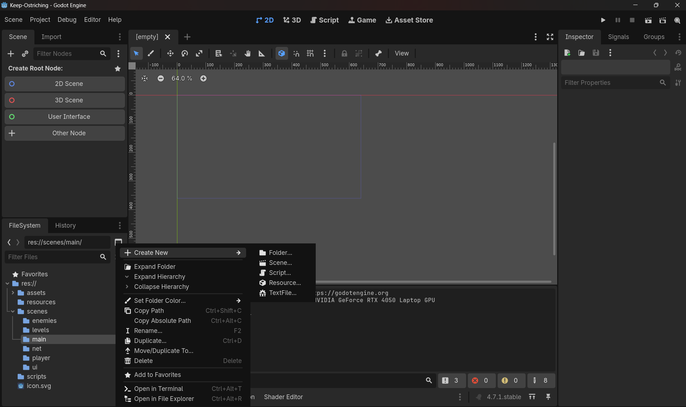
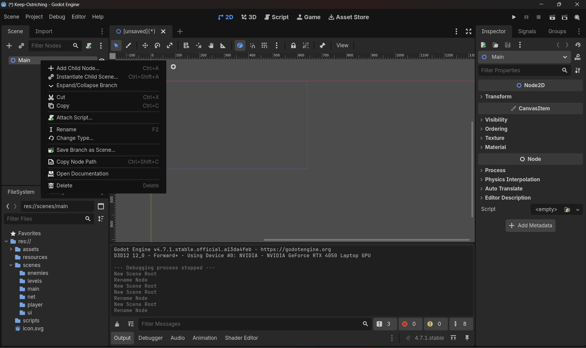
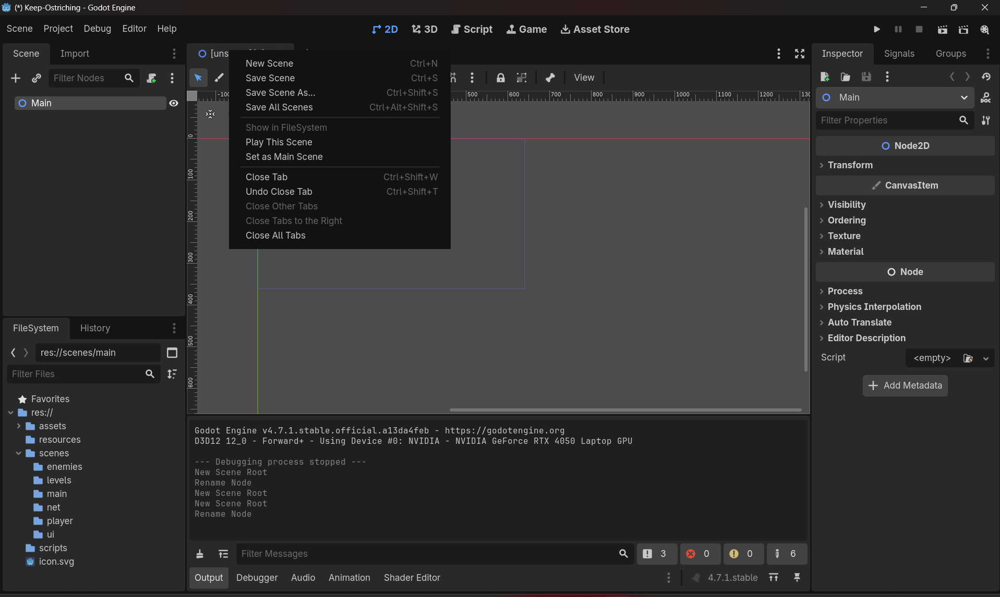

## 🌱 Scenes and Nodes in Godot

- Every **scene** in Godot requires a **root node**.  
- A scene can contain multiple nodes, each with its own script.  
- The scene itself can also have a single script attached, which defines the behavior of the entire scene.  
- Projects can have multiple scenes, and these can be layered or stacked together to build a 2D game.  

👉 Rule of thumb:  
- A **root node** always belongs to a scene, and a scene always needs a root node.  
- A **child node** does not need its own scene, since it exists under the parent scene.
- There is always only one root node of that respective scene.

---

## 🖱 Working with Scenes in the FileSystem Dock

1. **Creating a Scene from the FileSystem Dock**  
   - When you create a scene directly from the FileSystem Dock, Godot automatically generates a root node for it.  
   - Right-clicking the `.tscn` file shows options to manage the scene.  
   - Example:  
       
   - ✅ Advantage: No extra hassle — the root node and scene are already linked.

2. **Creating a Standalone Root Node**  
   - You can also create a root node manually.  
   - When you do this, it automatically becomes a new scene.  
   - To keep it, you must save the scene as a `.tscn` file in your desired location.  
   - Example:  
       
   - ⚠️ Note: Unlike step 1, here you **must manually save** the scene.

3. **Saving the Scene**  
   - Whether you start from the FileSystem Dock or by creating a root node, you’ll need to save the scene.  
   - Use **“Save Scene As…”** to store it in the project’s filesystem.  
   - Example:  
     

---

## ✨ Best Practice Tip
- The **easiest way** to create a new scene is directly from the FileSystem Dock (Step 1), since it automatically sets up both the root node and the scene.  
- Creating a root node first (Step 2) is more manual, but gives you flexibility if you want to structure things differently.
