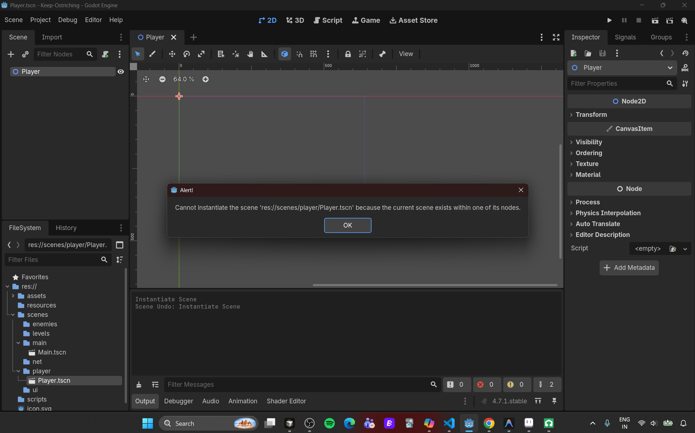
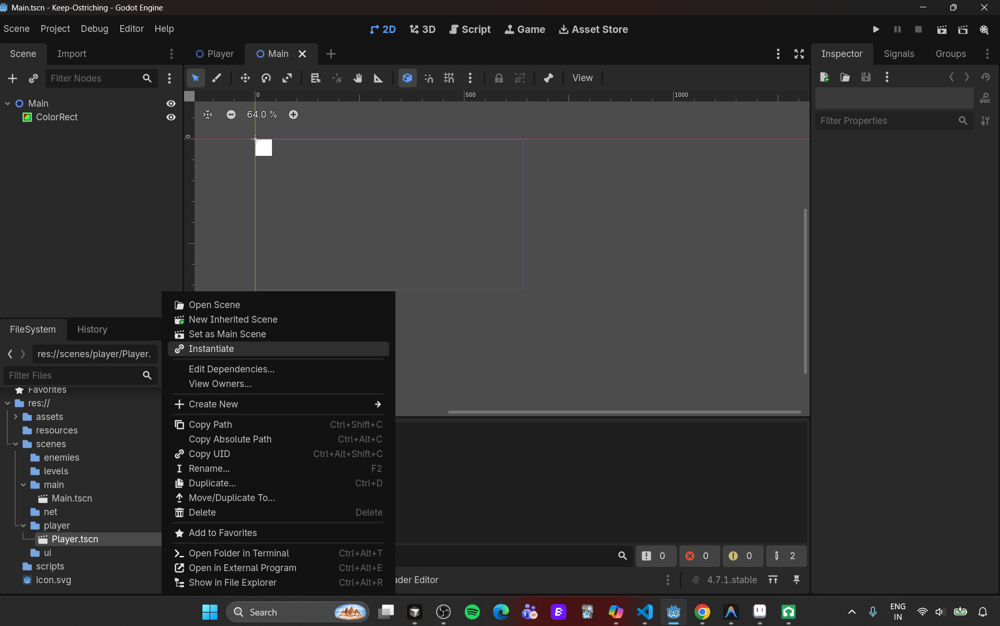
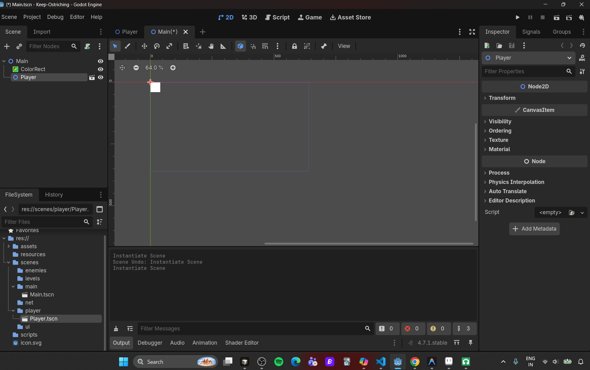
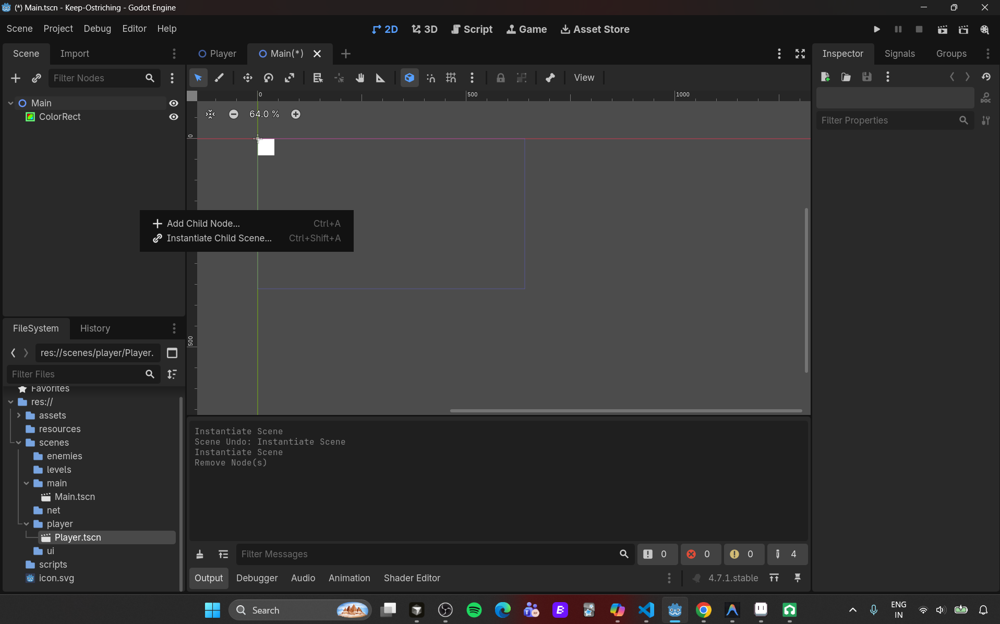
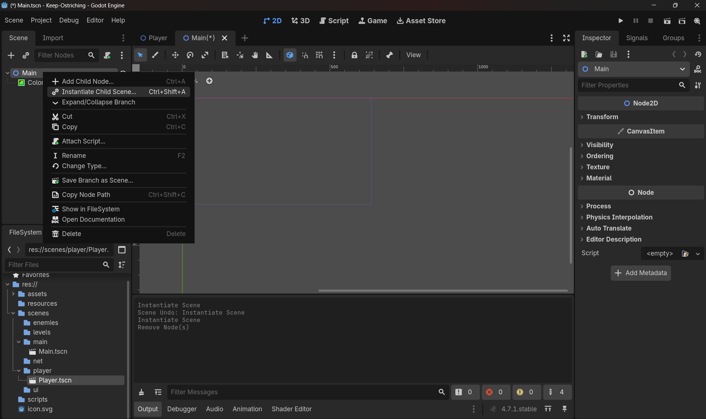
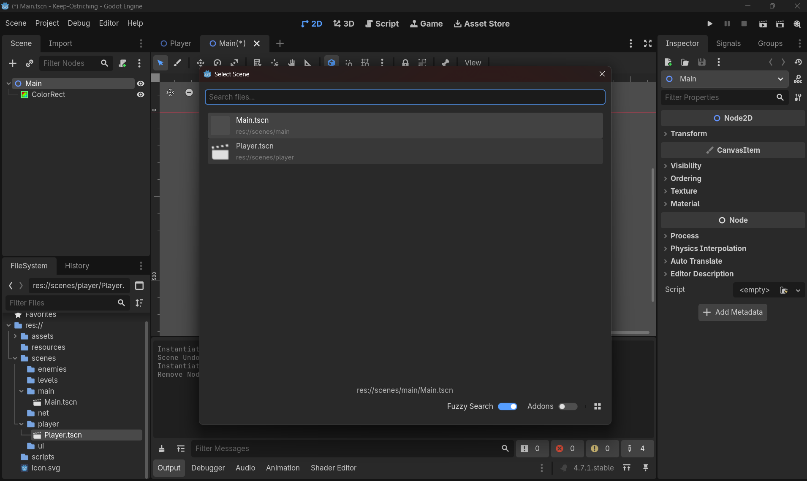
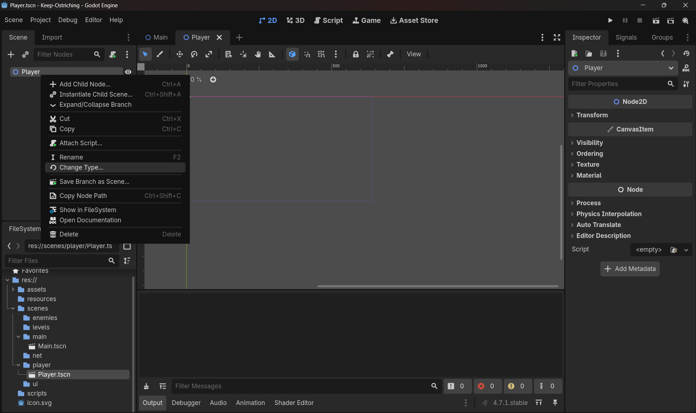
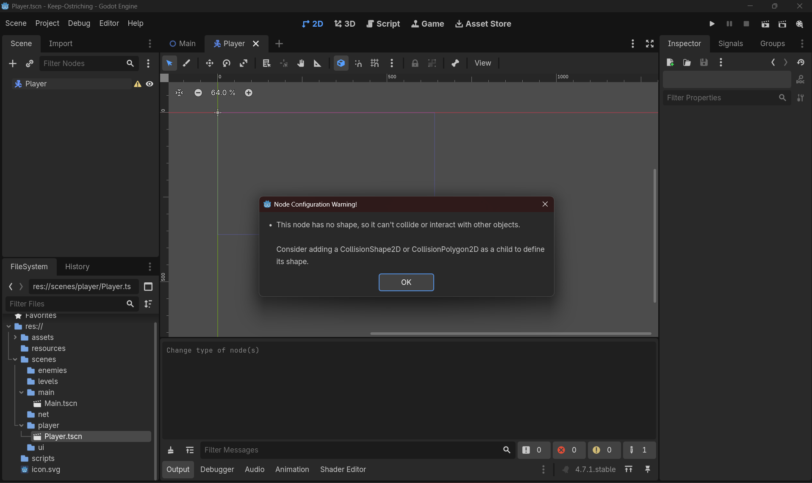
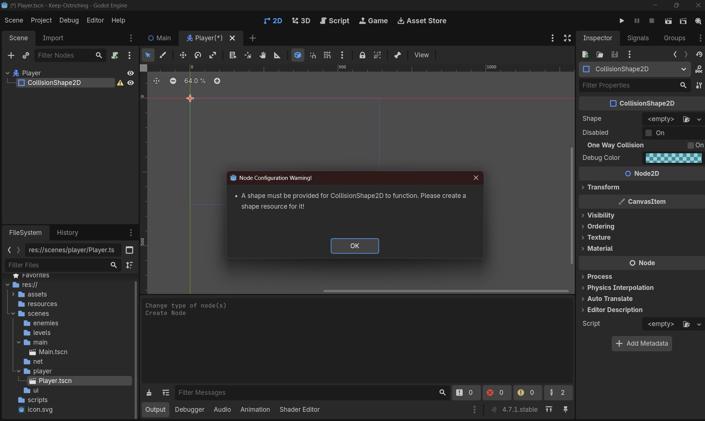
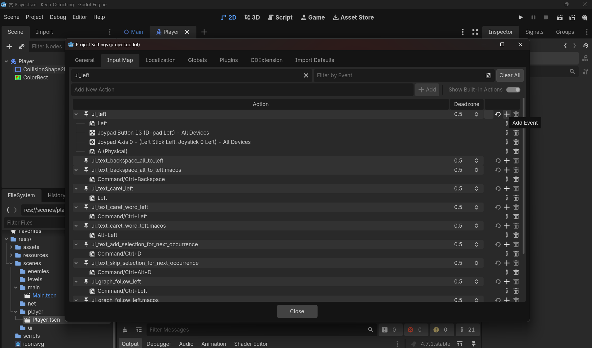

# Doubt 1: Scene Reusability & Instancing

**Doubt 1 — separate scene vs nested in Main:** Build `Player.tscn` as its own standalone scene file, not as nodes buried inside `Main.tscn`. A separate scene file is a reusable blueprint — you can drop copies of it anywhere, test it in isolation, and (critically) Day 5's local co-op and Day 10's networked spawning both depend on `Player` existing as its own `.tscn` file to instance from.

**Follow-up — does instancing multiply copies automatically:** No. Instancing means "create one node tree from this blueprint," and it only ever creates **one** instance per call. Godot never auto-generates extra copies for you — if you want 2 players, you instance `Player.tscn` twice, manually. The one exception that *looks* automatic is `MultiplayerSpawner` (Day 10), which just calls that same "instance it" step for you every time a new peer connects — still one instance per trigger, not a batch.

**Net takeaway:** separate scene files exist so instancing is *cheap and repeatable*, not so it happens *automatically*. You'll always be the one deciding how many instances to create and when.

# Doubt 2 : Instantiate

```
Open any scene for eg, Main.tscn --> Right click other scenes not Main itself for eg, Player.tscn --> click on instantiate --> Now, Player scene has been instantiated under Main scene
```
## Note:
- If you try to instantiate the Main scene to itself a error will be thrown as below:
    - Error: 
- Meaning: This error means you tried to instance a scene inside itself. In your case, Player.tscn is already the root scene, and you attempted to add another Player.tscn as a child of the Player node. Godot blocks this because it would create an infinite recursive loop. 
- If you try to add that same scene as a child of itself, Godot would have to keep nesting Player.tscn inside Player.tscn forever.

## There are two ways to instantiate a child scene or any scene:
### 1, From FileSystem:
- So, here you open/click any scene you want to get a instance for eg main scene, right click on any other child scene click on instantiate.
    - Visual: 
    - After look in NodeDock: 
### 2, from Node Dock itself:
- So, in filesystem dock click on the main scene(Whichever scene wanna have instance or child scene), right click in NodeDock or right click on main node --> Click on Instantiate child scene --> A window opens --> select whichever scene except itself, for more info about error look above!
- Right click on dock: 
- Right click on main node: 
- After right click, commom window: 

# Doubt 3: All about Input functions
## `Input.get_axis(negative_action, positive_action)`

**What it does:** Checks two opposing actions and gives you back a single float between -1 and 1 representing the net direction.
- Only negative action pressed → `-1.0`
- Only positive action pressed → `1.0`
- Neither pressed → `0.0`
- Both pressed at once → `0.0` (they cancel out)

**When to use it:** Any time a movement or value is naturally a *pair of opposites* — left/right, up/down, forward/backward, throttle/brake. Basically anywhere you'd otherwise write "if left pressed do -1, if right pressed do +1."

**Why use it:** It's one function call instead of two `if` checks, it automatically handles the both-pressed-cancel-out case for you, and — this is the big one — it's built to also work seamlessly with analog input (gamepad stick, trigger pressure) later, returning values like `0.35` instead of just -1/0/1. Writing your own version with `is_action_pressed()` would only ever give you the digital -1/0/1 case unless you specifically account for analog.

**How to use it:**
```
var x := Input.get_axis("ui_left", "ui_right")
var y := Input.get_axis("ui_up", "ui_down")
var direction := Vector2(x, y)
```
You pass it two *action name strings* (the same names you'd see in Project Settings → Input Map), and it returns the float. Combine two axis calls (X and Y) into a `Vector2` to get full 2D direction.

---

## `Input.is_action_pressed(action_name)`

**What it does:** Checks a single action and returns `true` if it's currently held down, `false` otherwise. No pairing, no float — just a boolean for one specific input.

**When to use it:** Any action that *doesn't* have a natural opposite — Jump, Kick, Plunge, Interact, Pause. There's no "negative Jump" to pair it with, so `get_axis()` doesn't apply; you just need to know "is this one button down right now."

**Why use it:** It's the right tool when you genuinely only care about one binary state, not a spectrum between two opposites. Using `get_axis()` for something like Jump would be forcing a two-action pattern onto something that's inherently one action — unnecessary and confusing.

**How to use it:**
```
if Input.is_action_pressed("ui_accept"):
    # jump logic here
```
Note: `is_action_pressed()` is true for *every frame* the key is held — for a one-shot action like Jump where you only want it to fire once per press, you'll actually want `Input.is_action_just_pressed()` instead (fires true only on the exact frame the key goes down). That distinction becomes relevant on Day 3 when you build Jump.

## Doubt: What happens when Left and Right are pressed at the same time?

**Short answer:** Nothing random happens — the result is deterministic and predictable, every time.

**Why:** `get_axis(negative_action, positive_action)` is essentially computing:
```
float(is_action_pressed(positive_action)) - float(is_action_pressed(negative_action))
```
Each boolean converts to `1.0` (pressed) or `0.0` (not pressed). Press both Left and Right together → `1.0 - 1.0 = 0.0`, every single time. Same inputs always produce the same output — that's what "deterministic" means. Think of it like tug-of-war: equal force from both ends nets zero movement, not a random direction.

**The precision that matters:** this cancellation only zeroes out **that one axis** — it doesn't freeze the character entirely. X and Y are computed independently via two separate `get_axis()` calls. So holding Left+Right (X cancels to 0) while also holding Up (Y = -1) still moves the Ostrich straight up — only the conflicting axis goes neutral, the other keeps working normally.

**Takeaway:** `get_axis()` is for opposing action pairs. Both pressed at once → that pair's contribution becomes zero, other axes unaffected. This is the same "what happens when two things compete" question you'll revisit on Day 3, when Jump and Plunge inputs can potentially overlap.

# Doubt 4: All about CharacterBody2D, CollisionShape2D & ColorRect
## 🎮 Notes — CharacterBody2D, CollisionShape2D, ColorRect

**`CharacterBody2D`**
- **What it is:** A specialized physics body node meant for characters you move *directly through code* — not through physics forces like gravity pulling a `RigidBody2D` around.
- **Key built-in property:** `velocity: Vector2` — you set this yourself in script; the node doesn't calculate it for you.
- **Key built-in method:** `move_and_slide()` — reads whatever you set `velocity` to, moves the body that amount (internally scaled by the physics delta), and handles collision response automatically — stopping or sliding along anything solid it hits, rather than passing through it.
- **What it does NOT do on its own:** it has no shape and no visual by default. It's just a "container" node that *can* move and collide — it needs children to define what it looks like and what it physically occupies.

**`CollisionShape2D`**
- **What it is:** A child node that defines the *physical boundary* the physics engine uses — this is what actually collides with walls, other bodies, etc.
- **Invisible at runtime** — you'll never see it in the actual game, only in the editor (as a colored outline) unless you turn on debug collision shapes.
- **Requires a Shape resource** — it doesn't do anything until you assign one (e.g. `RectangleShape2D`, `CircleShape2D`) via its Inspector "Shape" field. Without this, your `CharacterBody2D` has literally nothing to collide with — it'll pass through walls, other bodies, everything.

**`ColorRect`**
- **What it is:** A purely visual UI/2D node — a solid-colored rectangle, nothing more.
- **No collision, no physics involvement whatsoever.** It exists solely so you have *something visible* to look at while testing, before real art exists.
- **Origin point matters:** its `Position` is its **top-left corner**, not its center — unlike how you'd naturally think of a character's position as its center. This is why it needs an offset to visually align with a centered `CollisionShape2D`.

**Why all three work together**
`CharacterBody2D` is the "brain + mover," `CollisionShape2D` is "what physics sees," `ColorRect` is "what your eyes see." They're deliberately separate concerns — later you'll swap `ColorRect` out for `AnimatedSprite2D` (Day 12) without touching collision or movement logic at all, *because* they were never tangled together in the first place.

## ✅ Instructions — Build Player.tscn (no code, you do every step)

1. **Open `Player.tscn`** (double-click it in the FileSystem dock if it's not already open).

2. **Confirm the root node**: In the Scene dock, you should see `Player` as the root, of type `CharacterBody2D`. If not, that's step 0 you'd need to redo — but based on earlier, you've already got this.

3. **Add the CollisionShape2D**:
   - Right-click `Player` in the Scene dock → Add Child Node
   - Search for `CollisionShape2D`, select it, click Create
   - With `CollisionShape2D` selected, look at the Inspector panel → find the `Shape` property → click the dropdown next to it (currently `<empty>`) → choose "New RectangleShape2D"
   - Click into that new RectangleShape2D resource (click the shape icon/thumbnail) → set its `Size` to something like `32 x 32`

4. **Add the ColorRect**:
   - Right-click `Player` again → Add Child Node
   - Search for `ColorRect`, select it, click Create
   - In the Inspector, set its `Size` to match — `32 x 32`
   - Set its `Position` — since `ColorRect`'s origin is top-left (not center like the collision shape), set Position to `(-16, -16)` so it visually centers on the CollisionShape2D
   - Optional: pick a `Color` in the Inspector so it's not the default (usually white/black) — makes it easier to see

5. **Check alignment**: Look at the 2D viewport now — you should see a colored square, and if you select `CollisionShape2D`, its outline (dashed/colored border) should overlap exactly with the `ColorRect`. If they're offset from each other, fix the ColorRect's Position until they line up.

6. **Save the scene**: Ctrl+S.

## How to change the type of the node or main scene(Root node is aka scene)
- Look at the image: 
- When you don't add a collisionShape to the characterBody it shows the following error: 
- So, solution is just add collision to it as a child node of player.(Remember player is a characterBody2d node)
- Even after adding a collision it shows some what same error, that collisionbody2d requires a shape, rect , cirlce or so on.
- Look at the image: 
- How?, With `CollisionShape2D` selected, look at the Inspector panel → find the `Shape` property → click the dropdown next to it (currently `<empty>`) → choose "New RectangleShape2D",Click into that new RectangleShape2D resource (click the shape icon/thumbnail) → set its `Size` to something like `32 x 32`
- OR, If wanna make it custom like a 2d person, click on load from the image below: 
- Work isnt done yet, now u added shape but to make it visible for human eyes add colorRect node with size 32x from inspector,Set its `Position` — since `ColorRect`'s origin is top-left (not center like the collision shape), set Position to `(-16, -16)` so it visually centers on the CollisionShape2D
### Why `(-16, -16)` for the ColorRect's Position

**The core issue: two different nodes measure position from two different reference points.**

- `CollisionShape2D`'s shape (the `RectangleShape2D`) is defined **centered on its own origin**. So a 32×32 `RectangleShape2D` extends 16px in every direction from wherever `CollisionShape2D` sits — that's `CollisionShape2D`'s `Position` (usually `(0,0)`, right at the `Player` node's origin, since you likely didn't move it).

- `ColorRect`, on the other hand, draws itself **from its top-left corner**. If you set `ColorRect`'s `Position` to `(0,0)` with `Size = (32,32)`, it doesn't span from -16 to +16 like the collision shape does — it spans from `(0,0)` to `(32,32)`, entirely to the bottom-right of the origin.

**So without the offset**, your visible square and your invisible collision box would be sitting in completely different places — you'd *see* the rectangle in one spot, but the character would *collide* as if it were 16px up and to the left of what you see. Classic invisible-wall-feeling bug.

**The math behind `-16`:** you want the ColorRect's top-left corner to land at `(-16, -16)` so that, combined with its `32×32` size, it spans exactly from `(-16,-16)` to `(16,16)` — i.e., centered on the origin, same as the collision shape. That's just: `-(size / 2)` on both axes → `-(32/2) = -16`.

**General formula to remember** (you'll use this constantly): for any `ColorRect` (or later, any top-left-anchored visual) you want centered on a point, set:
```
Position = (-width/2, -height/2)
```

### What is a resource?
**What it is:** A `Resource` is Godot's base class for **data containers that aren't nodes** — think of it like a standalone data file (similar to a `.txt` or `.json`, but Godot-native and typed). It holds data (a shape's size, a texture's pixels, a script's code) and exists independently of any node in the scene tree — no position, not drawn, not processed on its own. A node just *points to* a Resource; it doesn't own it. `RectangleShape2D` (what you assigned to `CollisionShape2D`'s Shape property) is a Resource. So are `Texture2D` (images), `AudioStream` (sounds), `PackedScene` (a `.tscn` file itself), `Script` (your `.gd` files), animations, materials, fonts — a huge chunk of Godot is Resources under the hood.

**Why they exist — sharing without duplicating:** a single Resource can be assigned to *multiple* nodes at once, and they all reference the *same* underlying data. Change the file once, every node using it updates. Compare that to baking the same settings into each node individually, where you'd have to edit every copy by hand and risk them drifting out of sync.

**When you'd reach for one:**
- Any Inspector field showing "\<empty\>" with a dropdown offering "New \<Type\>" or "Load" is asking for a Resource — you've already done this with Shape.
- When data should be reusable across multiple nodes/instances (like a hitbox shared by every player).
- When you want a custom data structure (e.g. a future `PlayerStats` Resource for health/speed) that isn't tied to any one node.

---

### Practical: create and save a Resource properly

Right now your `RectangleShape2D` is likely **embedded** — created inline when you clicked "New RectangleShape2D," living invisibly inside `Player.tscn` itself rather than as its own file. Let's convert it into a real, reusable file:

1. Select `CollisionShape2D` in your Scene dock.
2. In the Inspector, find the **Shape** field — you'll see the `RectangleShape2D` as an expandable inline resource.
3. Click the resource's dropdown icon (not the expand arrow) → a context menu appears with "Edit", "Save As...", "Make Unique", etc. → click **Save As...**
4. If you don't already have one, create a `resources/` folder at your project root first (right-click FileSystem dock → New Folder).
5. In the save dialog, navigate to `res://resources/`, name it something descriptive like `player_hitbox.tres`, click Save.
6. Check the Shape field again — it should now show a file path (`player_hitbox.tres`) instead of an inline/embedded resource, and you'll see the file appear under `resources/` in the FileSystem dock.

**Why this matters for you specifically:** on Day 5, when Player 2 joins for local co-op, both players should share the same hitbox. Instead of manually recreating a `RectangleShape2D` and hoping the size numbers match exactly, you'd drag `player_hitbox.tres` from the FileSystem dock directly into Player 2's `CollisionShape2D` → Shape field. Both now point to the *same file* — resize one, both update, guaranteed to match.

**In code, this looks like:**
```gdscript
@export var hitbox_shape: RectangleShape2D  # assign player_hitbox.tres via Inspector
# or, when the path is fixed and known ahead of time:
var hitbox = preload("res://resources/player_hitbox.tres")
```
`preload()` loads at compile time (faster, and Godot flags a bad path immediately) — use it whenever you know the file path in advance, which is most of the time. `load()` reads from disk at runtime, useful when the path isn't known until the game is running (e.g. loading user-selected content).

# Doubt 5: Input Map
## 🎮 Project Settings → Input Map — deep dive

**What it actually is:** a translation layer between "physical keys/buttons" and "named actions" your code refers to. Instead of your script checking "was the K key pressed," it checks "was the action called `ui_left` pressed" — and the Input Map is where you decide *which physical keys* trigger `ui_left`.

**Why this indirection matters:** if your code hardcoded actual key codes (`KEY_LEFT`), rebinding controls later (a settings menu, different keyboard layouts, gamepad support) means rewriting code. With named actions, you just change the *mapping* in Project Settings — zero code changes. Same principle as your `input_source` dictionary, one level up.

**What's already there by default:** Godot ships with `ui_left`, `ui_right`, `ui_up`, `ui_down`, `ui_accept`, etc. — pre-bound to arrow keys (and WASD isn't bound by default for these, only arrows + numpad, worth checking).

**Practical steps — go check this now:**
1. Project menu (top menu bar) → Project Settings → **Input Map** tab.
2. Find `ui_left` in the list, click the arrow to expand it — you'll see which keys are bound (should show something like "Left" for the arrow key icon).
3. Click image ref to add: 
4. **Do this today:** click the `+` icon next to `ui_left` to add another binding, press the `A` key when prompted, so both Left Arrow and A work. Repeat for `ui_right`→D, `ui_up`→W, `ui_down`→S. This isn't strictly required for the Ostrich to move, but WASD is the more common convention and you'll want it once Day 5 forces you to make room for Player 2's arrow keys.

You don't need custom `p1_left`/`p2_left` actions yet — that's Day 5's job specifically because two players can't both claim `ui_left`. Today, one player, default actions are fine (just widen them to include WASD).

---

## 📐 Quick math re-confirmation before you code

You already worked through: `direction = Vector2(get_axis("ui_left","ui_right"), get_axis("ui_up","ui_down"))`, then `velocity = direction * speed`, and `move_and_slide()` handles the delta multiplication internally. That's the full chain — nothing new here, just confirming it's locked in before you type it.

---

## Now — the actual script, written by you

Open `scripts/player.gd`. Using everything from today (GDScript syntax, `get_axis()`, `input_source` concept, `_physics_process`), write:

1. An `@export var speed` 
2. An `input_source` variable holding your chosen mapping (you decided this shape earlier — keep it consistent with what you designed)
3. A `_get_direction()` function that returns a `Vector2` built from `get_axis()` calls, pulling action names *from* `input_source`, not hardcoded inline
4. `_physics_process(delta)` that sets `velocity = _get_direction() * speed` and calls `move_and_slide()`

# Doubt 6: Maths
## Doubt 6: Does get_axis()'s -1 to 1 range mean the object can't move past those bounds?

**Short answer:** No — that mix-up is worth untangling carefully, because it conflates two different things: **direction/input value** vs **actual position in the world**.

**What -1 to 1 actually represents:** `get_axis()` only tells you *which way* the input is pointing and how strongly (for analog sticks) — it says nothing about *distance traveled*. It's the `x` or `y` component of your `direction` vector, not a position or a distance.

**Where speed and time come in:** Your actual velocity is `direction * speed`. If `direction.x = 1.0` and `speed = 300.0`, then `velocity.x = 300.0` — pixels per second, not "1 pixel total." Position then accumulates every physics frame via `move_and_slide()` (internally doing `position += velocity * delta` each tick). Over 5 seconds of holding right, you've moved `300 * 5 = 1500` pixels — nowhere close to being capped at "1."

**Analogy:** think of `get_axis()` as a steering wheel, not an odometer. Turning the wheel fully right gives you `1.0` — that doesn't mean the car can only travel 1 meter, it means "steer fully right," and how far you actually go depends on how long you hold the gas (⇔ how many physics frames pass) and how fast the engine can go (⇔ `speed`).

**One genuine subtlety worth flagging (relates to your normalization doubt earlier):** the -1 to 1 range *does* cap the raw `direction` vector's components, which is exactly why diagonal movement (direction like `(1, 1)`, magnitude ≈1.41) moves faster than straight movement (direction like `(1, 0)`, magnitude 1) unless you call `.normalized()`. So the cap affects *direction magnitude*, which indirectly affects speed consistency — but never position, which is unbounded and just keeps accumulating over time.

**Test it yourself:** hold Right for 1 second vs 5 seconds in your running scene — the Ostrich should travel roughly 5x farther in the second case, confirming position isn't capped by that -1/1 range at all.

# Doubt 7: In Inspector when u click on a .gd file, why does this file appear under resources section. Does it mean that .gd file is a resource?

**Short answer: yes, genuinely — a `.gd` script *is* a Resource**, not just displayed like one.

**The inheritance chain (same concept as your `extends CharacterBody2D` question, one level down):**
```
Resource → Script → GDScript
```
`Script` is a subclass of `Resource`, and `GDScript` (what your `.gd` files actually are under the hood) is a subclass of `Script`. So by the same inheritance logic you just learned — "extends X means you inherit X's stuff" — a `.gd` file inherits everything a `Resource` is: something loadable via `load()`/`preload()`, assignable to a property slot, shareable across multiple nodes, and yes, it appears in resource-related UI like the Inspector's script slot.

**Why this actually makes sense conceptually:** a script is fundamentally just *data describing behavior* — code text that Godot loads and interprets, the same way a `RectangleShape2D` is data describing a shape, or a `Texture2D` is data describing pixels. None of these "do" anything on their own; they need to be *attached to* or *referenced by* a node to take effect. That's exactly the Resource pattern: standalone, node-independent data that something else points to.

**Concrete proof, if you want to verify it yourself:** in the Inspector, when a node has a script attached, click the script icon in the top bar — you get the same kind of context menu (Edit, Clear, Save As, Make Unique) you saw with your `RectangleShape2D`. That's not a coincidence or a UI similarity — it's literally the same Resource-handling machinery, because a `Script` genuinely is a `Resource` type.

**Connecting it back to something you already know:** this is also *why* `preload("res://scripts/player.gd")` is valid, legal code in Godot — you can preload a script the exact same way you'd preload a texture or a shape resource, because they're all just different flavors of the same base type.

**One-line takeaway:** in Godot, "Resource" isn't a special category some files belong to — it's the base class for *any* loadable, reusable, node-independent data, and scripts happen to be one specific kind of that data.