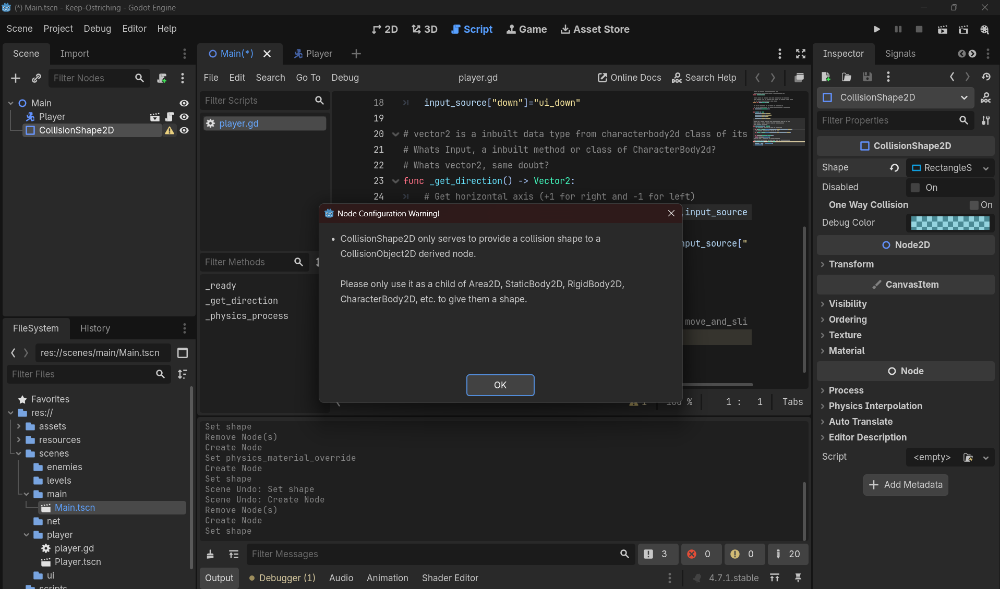
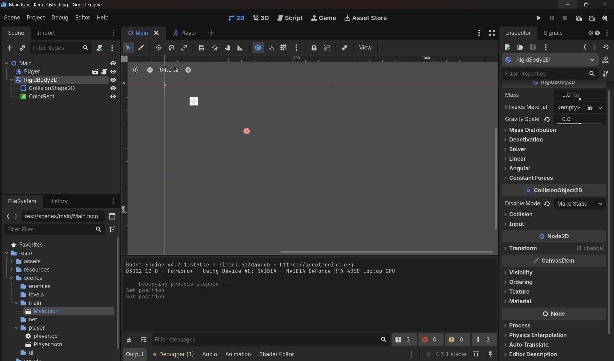

## Now, add a collision shape to the color rect to see if ur player scene actually collides with it
- CollisionShape2D only works for CollisionObject2D, that can be Area2D or CharacterBody2D or RigidBody2D or so on, 
- as mentioned in below image: 
- So, add a rigid body as in this image: 
- Make sure to make collision as static as mentioned in inspector
- At end make sure collision body and color rect has same size and are placed somewhere like centre of viewport.
- Also make sure gravity is set to zero.
## How to change the size of color rect and rigidbody and collisionbody as one
Let's fix this properly — same principle as your Player setup, applied to the RigidBody2D obstacle.

### Step-by-step: resize & align RigidBody2D's shape + visual

1. **Select `RigidBody2D`** in the Scene dock first — check its own `Position` in the Inspector (Transform section). This is where the *whole object* sits in the world. If it's off in negative coordinates or far outside your viewport's visible area (viewport looks like roughly 0-1000 horizontal, 0-500-ish vertical based on your screenshot's rulers), that's likely why you're not seeing it where expected. Set `Position` to something clearly inside view, like `(400, 300)`.

2. **Select the `CollisionShape2D`** child (under RigidBody2D). Check its Inspector:
   - **Position** — this should almost always be `(0, 0)` relative to its parent `RigidBody2D`, so it sits exactly at the RigidBody2D's origin. Don't offset this one.
   - **Shape** field — click the dropdown/expand arrow to open the `RectangleShape2D` resource, and set its `Size` to whatever you want, e.g. `48 x 48`.

3. **Select the `ColorRect`** child. Same logic as your Player's ColorRect:
   - **Size** — set to match the collision shape's size, `48 x 48`.
   - **Position** — since `ColorRect` draws from its top-left corner (not centered like the collision shape), offset it by half its size in the negative direction: `(-24, -24)` for a 48×48 size. Formula, same as before: `(-width/2, -height/2)`.

4. **Visually confirm in the 2D viewport**: click `RigidBody2D` and you should see its collision outline (dashed border) directly overlapping the `ColorRect`'s visible fill, sitting inside your visible camera/viewport area — not floating off in the gray space outside the rectangle boundary shown in the editor.

5. If it's still not visible, check the **2D viewport's zoom/pan** — you might just be scrolled/zoomed to a spot that doesn't include where the RigidBody2D actually is. Press `Shift+F` (or the "frame selected" option) with the node selected to snap the camera to it.
