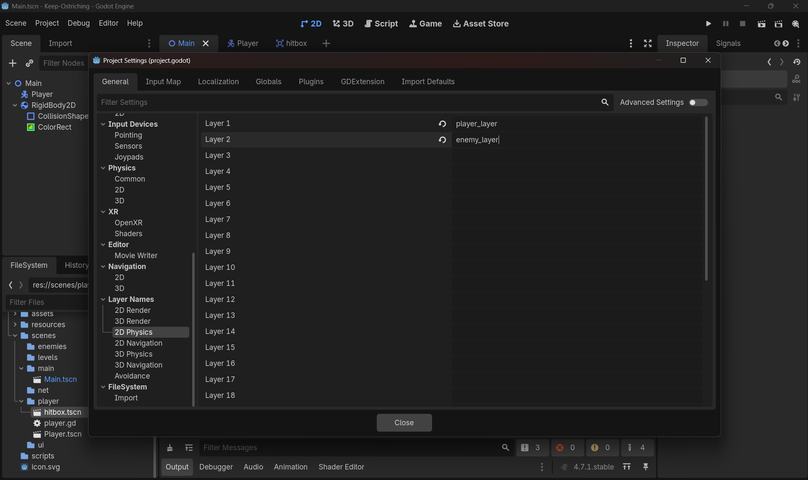
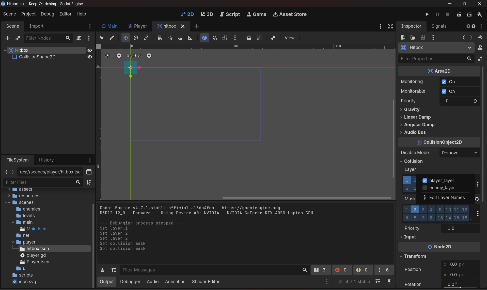

**1. Create `Hitbox.tscn`**

- Editor way: In the FileSystem dock, right-click `scenes/player/` → **New Scene**. In the Scene dock, click **Other Node** → search `Area2D` → set as root, rename it `Hitbox`. Save as `scenes/player/Hitbox.tscn` (Scene → Save Scene, or Ctrl+S).
- Add the shape: with `Hitbox` selected, click the **+** (Add Child Node) → search `CollisionShape2D` → Add. In the Inspector for that node, click the `Shape` field dropdown → **New RectangleShape2D**. Click on the shape in the 2D viewport to drag its size handles until it roughly covers your Ostrich's kick range, positioned slightly in front of the body (you may need to move the `CollisionShape2D` node's Position in the Inspector too).

There's no meaningful "code way" for step 1 — scene creation is editor-only.
```MD
**Doubt 1: Why `Area2D` and not `CharacterBody2D` or `RigidBody2D`?**

Each node type has a distinct job:
- `RigidBody2D` — physics-driven. Engine controls motion via mass, gravity, forces, collision response (bounce/push). You never call `move_and_slide()`; you apply forces and let physics decide.
- `CharacterBody2D` — you drive it. You control velocity and call `move_and_slide()` every physics frame yourself; engine only assists with sliding along collision.
- `Area2D` — not a physics body at all. No mass, no collision response, nothing pushes or is pushed. Its only function is reporting geometric overlap via signals.

A kick hitbox needs pure "what's in range right now" detection, riding along with the parent for free — with zero physics interference. `RigidBody2D` would actively simulate collision response (push/bounce) between hitbox and enemy, which is wrong for a sensor. `CharacterBody2D` would require manual movement code for something that isn't independently moving. `Area2D` is the only type whose entire purpose matches the need: sensor, not body.

**Doubt 2: Could `CharacterBody2D` or `RigidBody2D` technically do this instead?**

- `RigidBody2D` — partially, yes. It has `body_entered`/`body_exited` signals, but they're disabled by default (`contact_monitor = false`). Enabling them (`contact_monitor = true`, `contact_monitoring > 0`) also opts you into full physics simulation — gravity, mass, collision response — that you then have to manually cancel out (zero gravity_scale, lock rotation, etc.) just to neutralize. You pay real physics-simulation cost for a feature you're suppressing.
- `CharacterBody2D` — structurally cannot do it. It has no overlap-detection signal at all. Its only collision feedback is a byproduct of calling `move_and_slide()` — inspected afterward via `get_slide_collision_count()`/`get_slide_collision(i)`. It only reports contact while actively sliding into something that frame; a stationary overlap (hitbox sitting on an enemy with no movement) reports nothing.

Net: `RigidBody2D` is capable but requires fighting off unwanted physics at a real performance cost; `CharacterBody2D` is incapable of passive overlap detection since it has no signal system for it; `Area2D` is purpose-built for exactly this — geometric overlap, signal-driven, no physics cost riding along.
```

---

**2. Instance `Hitbox.tscn` as a child of `Player.tscn`**

- Editor way: Open `Player.tscn`. Right-click your root Player node in the Scene dock → **Instantiate Child Scene** (or click the chain-link icon in the Scene dock toolbar) → select `Hitbox.tscn`.
- Code way: not applicable at the scene-composition level — instancing into a *saved* scene tree is normally done in the editor so it persists. (You *can* instance scenes purely at runtime via `PackedScene.instantiate()` in code, but that's a different pattern for spawned things like bullets/enemies, not for a permanent child like this hitbox — skip it here.)

---

**3. Assign Layer & Mask**
```MD
**Doubt 1: What's the difference between Layer and Mask?**

Two different questions each node asks:
- **Layer = "What am I?"** — the category this node broadcasts itself as. A label on that node.
- **Mask = "What do I care about?"** — the categories this node is listening for. A filter on what it notices.

A signal like `area_entered` fires when one node's **Mask** matches the other node's **Layer** at the same bit slot. Example: Hitbox's Layer = `player_hitbox` (identifies itself), Hitbox's Mask = `enemy` (listens for enemies). If Mask is pointed at the wrong category (e.g. `player_hitbox` instead of `enemy`), nothing will ever fire even though everything "looks" configured — classic silent bug.

Still to test yourself: whether matching is one-directional (only Hitbox's mask needs to include enemy's layer) or bidirectional (enemy's mask must also include Hitbox's layer). Set only one side and observe if `area_entered` still fires.

**Doubt 2: Why Project Settings → 2D Physics, not 2D Render?**

Both live under the same "Layer Names" group in Project Settings and show identical Layer 1–20 lists, but they control unrelated systems:
- **2D Render** — controls visibility/drawing (e.g. which canvas layer a sprite renders on). Nothing to do with collision.
- **2D Physics** — controls collision detection. This is what `Area2D`/`CharacterBody2D`/`StaticBody2D`/`RigidBody2D` actually read for their Layer/Mask checkboxes, and what determines whether `area_entered`/`body_entered` signals fire.

Naming a layer under Render gives you a label that never appears on your Hitbox's Inspector — it's the wrong bitmask system entirely.

**Doubt 3: Does the name have to match between Hitbox's mask and enemy's layer?**

Not the *name* — the *bit position*. The name (e.g. `enemy`) is just a human-readable label on a specific checkbox slot; Godot compares whether the same underlying bit is set on both sides, not the text. Since both nodes' panels show that slot under the same label, it looks like "matching names," but the actual mechanism is: Hitbox's Mask must have the checkbox checked at the same slot where the Enemy's Layer checkbox is checked — same slot, not same string.

---

**Instructions walked through so far:**

1. Project Settings → General tab → left sidebar → **Layer Names → 2D Physics** (not 2D Render).
2. Click into the text field beside `Layer 1` / `Layer 2` (or any slot) and type a name — e.g. `player_hitbox` for one slot, `enemy` for another.
3. On the `Hitbox` node's Inspector → **Layer** section: check the box now labeled `player_hitbox`.
4. On the `Hitbox` node's Inspector → **Mask** section: check the box labeled `enemy`.
5. (Pending your test) On the enemy node's Layer: check `enemy`. Whether its Mask also needs `player_hitbox` checked back is the experiment to run before Day 6 when enemies exist.
```
- Editor way: First register names — go to **Project → Project Settings → General tab → Layer Names → 2D Physics**. Fill in a row with something like `player_hitbox`, and a separate row with `enemy` (even though no enemy exists yet). Then select the `Hitbox` node → Inspector → **CollisionObject2D → Collision → Layer** section: check only the `player_hitbox` box. In the **Mask** section: check only the `enemy` box.
- Image for this menthod, instructions and doubts cleared in the MD Block: 
- Look at right middle: 
- Code way: in `_ready()` (or anywhere before it's needed), you can set `collision_layer` and `collision_mask` as integers directly — e.g. assigning the bit value that corresponds to whichever layer number you named. This is more error-prone by hand since you have to know which bit = which named layer, so I'd do this one in the editor and treat code-assignment as something to try later once it's second nature.

---

**4. Set `monitoring` to `false` by default**

- Editor way only: select `Hitbox` → Inspector → **Area2D → Area → Monitoring** → uncheck it.
- (You'll flip this in code at runtime in step 8 — the *default* state belongs in the editor so the scene always loads "off.")
- Why,
```
- ⚙️ **Scene safety & predictability**: When `Area2D → Monitoring` is enabled, the node immediately starts detecting overlaps as soon as the scene loads. That means signals like `area_entered` or `body_entered` could fire before your game logic is ready. By disabling it in the editor, you guarantee the scene always starts in a neutral, “off” state.

- 🎮 **Runtime control**: You’ll flip `monitoring` on in code later (step 8). This gives you precise control over *when* detection begins — for example, only after the player presses a button, enters a certain state, or when the game logic says it’s time. It prevents unwanted triggers during initialization.

- 🧩 **Consistency across reloads**: If you leave it checked in the editor, every time the scene reloads or instantiates, monitoring will be active again. Setting it off by default ensures consistency: the scene always loads “quiet,” and only your script decides when to activate it.

- 🚫 **Avoid phantom collisions**: With monitoring on by default, you risk detecting collisions with objects that shouldn’t matter yet (like spawn areas or setup nodes). Turning it off avoids these false positives.

In short: **Editor defaults define the baseline state of your scene. Runtime code defines the dynamic behavior.** By keeping monitoring off in the editor, you prevent accidental triggers and keep control firmly in your script.  
```
---

**5. Get a reference to the Hitbox in `player.gd`**

- Code way (this one's code-only): declare an `@onready var` pointing at the child, using the `$` shorthand for the node path — figure out the exact path based on where you named the Hitbox instance in the tree (it'll just be `$Hitbox` if you didn't rename the instance).
- Editor assist: you don't have to type the path from memory — drag the `Hitbox` node from the Scene dock directly into your script editor while your cursor is on that line; Godot auto-inserts the correct `$Path` string for you.
```MD
**Step-by-step for Step 5:**

1. Open `player.gd` in the Script editor (double-click the script, or click the script icon on your Player node in the Scene dock).

2. Find where your existing `var` declarations are — probably near the top, alongside things like your `plunge_timer` var from Day 3. Click at the start of a new blank line right below them.

3. Type:
   @onready var hitbox = 
   Stop right after the `=` and a space — don't type `$Hitbox` yet.

4. Now switch focus to the **Scene dock** (usually top-left, showing your node tree — Player, and its children including Hitbox). Find the `Hitbox` node in that tree.

5. **Click and hold** on the `Hitbox` node's name in the Scene dock, drag it over to the Script editor panel, and **drop it right after the `=`** where your cursor left off. Godot will auto-type something like `$Hitbox` (or `$Path/To/Hitbox` if it's nested deeper than expected) at that exact spot.

6. Your line should now read:
   @onready var hitbox = $Hitbox
   (or whatever path Godot actually inserted — that's the correct one, trust the drag-drop over guessing).

7. Save the script — **Ctrl+S** (or File → Save, or the disk icon at top of the Script editor).

8. Sanity check: click somewhere else in the script, then hover your mouse back over `hitbox` anywhere you might type it later — Godot's autocomplete should now suggest it as a known variable, confirming the declaration registered correctly.

That's it — `hitbox` is now available to reference anywhere else in `player.gd` (inside `_ready()`, your Kick function, wherever), without ever writing `$Hitbox` again by hand.
```
---

**6. Connect `area_entered` in `_ready()`** — this is the step with two real, equally valid paths:

- **Editor way**: select the `Hitbox` node → go to the **Node** dock (tab next to Inspector, has a signal icon) → find `area_entered(area: Area2D)` in the list → double-click it → in the popup, make sure "Connect to Script" targets your Player node/script → set the method name → **Connect**. Godot will auto-generate the empty `func _on_hitbox_area_entered(area):` stub in `player.gd` for you.
- **Code way**: in `_ready()`, call `.connect()` on the signal from your hitbox reference, passing the name of your callback function (no parentheses — you're passing the function itself, not calling it). You write the callback function yourself elsewhere in the script.

The doc's own hint leans toward code (more explicit, diff-able in version control) — pick that if you want the habit that scales better as your scripts grow, but try the editor way once first so you *see* what it's doing under the hood before you do it blind in code.

- What is this signal, why used here, how used here?
```MD
**Step-by-step for Step 6 — both paths, do Editor first, then Code**

---

### Path A: Editor way (drag/click, no typing signal-connect code)

1. Click on the `Hitbox` node in your Scene dock to select it (same node you dragged into the script in Step 5).

2. Look at the panel that usually sits next to (or as a tab alongside) the Inspector — top-right area of the editor by default. You want the tab labeled **Node** (it has a small signal/antenna-like icon, distinct from the Inspector's slider icon). Click it.

3. Inside the Node dock, you'll see two sub-tabs: **Signals** and **Groups**. Make sure **Signals** is selected.

4. Scroll the signal list until you find `area_entered(area: Area2D)` — it's listed under the `Area2D` category since that's where Hitbox inherits it from.

5. **Double-click** `area_entered(area: Area2D)`. A "Connect a Signal" popup opens.

6. In that popup, you'll see a mini scene tree — click your **Player** node (the script-holder) so the connection target is your `player.gd` script, not some other node.

7. At the bottom of the popup there's a **Method** field, pre-filled with something like `_on_hitbox_area_entered`. You can leave the auto-generated name as-is (recommended, matches the doc's naming) or edit it — just remember whatever you choose, you'll write the function body under that exact name.

8. Click **Connect** (bottom-right of the popup).

9. Godot now does two things automatically: it wires the connection in the scene file, **and** it jumps you into `player.gd` with an empty stub already written:

   func _on_hitbox_area_entered(area: Area2D) -> void:
       pass # Replace with function body.

10. Confirm it worked: back in the Node dock's Signals tab, `area_entered` should now show a small connection icon (a little green dot/link) next to it, and hovering shows it's connected to Player.

---

### Path B: Code way (what you'd write instead, if you skip Path A), has some limitations

*Don't do both on the same signal — pick one. If you already connected via the editor above, you can stop here, or undo it (select the connection in the Node dock's Signals tab → right-click → Disconnect) and try this way instead for practice.*

1. Open `player.gd`, find your `_ready()` function (create one if it doesn't exist yet: `func _ready() -> void:` on its own line, with the body indented below).

2. Inside `_ready()`, using your `hitbox` variable from Step 5, write:

   hitbox.area_entered.connect(_on_hitbox_area_entered)

   Note: no parentheses after `_on_hitbox_area_entered` — you're handing the function itself as a reference, not calling it right now.

3. Since the editor isn't auto-generating the stub for you this way, you write the empty function yourself, anywhere else in the script (commonly right below `_ready()`):

   func _on_hitbox_area_entered(area: Area2D) -> void:
       pass

   The parameter name/type must match what the signal emits — `area: Area2D` — or Godot will complain when you try to connect.

4. Save the script.

---

**Either path, verify the same way:** run the scene (F6), and in the next step (7) you'll fill in that `pass` with a `print()` — that's your actual proof the connection works, not just that it compiled without red text.

## Some limitations
**Q: Why does the Signals tab icon show for the editor-way connection but not the code-way one?**
A: The icon reflects connections saved in the scene file. Editor drag/click connections *are* saved there. `.connect()` in code never touches the scene file — it's created live in memory only while `_ready()` has run, so there's nothing for the static Signals tab to show.

**Q: Does that mean the code-way connection isn't really working?**
A: No — it works the same, just isn't visible the same way. It only exists while the scene is actually running.

**Q: How do I actually verify a code-way connection, then?**
A: Two options:
- Simplest: run the scene, trigger the overlap, watch for your `print()` in the Output panel. That's real proof it fired.
- To *see* it in the UI: while the scene is running, switch the Scene dock from **Local** to **Remote** tab, select Hitbox there, check Signals — it'll show connected in that live view only.

**Q: Is there a way to make a code connection show up in the normal (Local) Signals tab?**
A: No — that's not a setting to enable, it's just what the two methods are. Static (file-saved) vs runtime (script-made) are structurally different; only static ones appear at edit-time.
```

---

**7. Write the callback**

Code-only, no editor equivalent. Define `_on_hitbox_area_entered(area):` — inside, just `print()` something using the `area` parameter (e.g. its name) so you get visible proof in the Output panel when something overlaps.

---

**8. Toggle `monitoring` on/off around the Kick window**

- Code way A (reuse Day 3 pattern): wherever your Kick action currently triggers, set `hitbox.monitoring = true`, then accumulate a timer variable with `delta` each `_physics_process` frame the same way you did for `plunge_timer`, and flip it back to `false` once that timer crosses your chosen duration.
- Code way B (Godot `Timer` node): Editor — add a `Timer` child node under Hitbox (or Player), Inspector → set `Wait Time` to your kick-active duration, check `One Shot`. In the Node/signals dock for that Timer, connect its `timeout` signal (editor drag-drop or `.connect()` in code, same two choices as step 6) to a callback that sets `monitoring = false`. You still set `monitoring = true` and call `timer.start()` yourself when Kick begins.

Try B if you want practice with a second core Godot pattern (`Timer` node + `timeout` signal) rather than just reusing the delta-accumulator you already know.

---

**9. Test it**

- Editor way: drag any placeholder `Area2D` (with its own `CollisionShape2D`) into the scene near where Kick's hitbox will be, run the scene (F6 for current scene / F5 for project), trigger Kick, watch the Output panel at the bottom for your `print()`.
- Confirm the negative case too: trigger nothing (don't Kick) while overlapping the placeholder — the print should **not** fire. That negative test is the one people skip and it's the one that actually proves `monitoring` is doing its job instead of the shape just being coincidentally positioned right.

---

Report back with:
- What you set as your Layer/Mask names and which node got which
- Whether you went editor-connect or code-connect for the signal, and why
- Exactly where in your Kick logic `monitoring` flips true and false

I'll tell you straight whether it's actually scoped to the kick window or secretly always-on.
```MD
# Step 7 — Write the callback

Code-only, no editor path here — you're filling in the `pass` stub from Step 6.

1. Open `player.gd`, find the function you got (either auto-generated by the editor connect, or the one you wrote yourself for the code-way connect):

   func _on_hitbox_area_entered(area: Area2D) -> void:
       pass

2. Replace `pass` with a print statement that uses the `area` parameter — something like printing the name of whatever entered. Use `area.name` to get its node name as a string.
3. Type it as:

   print(area.name)

   or, if you want it more readable in the Output panel:

   print("Hit: ", area.name)

4. Save.

**Why `area.name` and not just `area`:** printing `area` directly would print an object reference (something like `[Area2D:1234]`), technically not wrong but not human-readable. `.name` gives you the actual string label you see in the Scene dock — much easier to eyeball during testing.

---

# Step 8 — Toggle `monitoring` on/off around the Kick window

Two paths, pick one to actually build (try the other later once comfortable):

### Path A: Delta-accumulator (reuse Day 3 pattern)

1. In `player.gd`, declare a new tracking variable near your other vars — same style as `plunge_timer`, something like `var kick_timer := 0.0` and a bool/flag for whether Kick is currently active, e.g. `var is_kicking := false`.
2. Wherever your Kick input/action currently triggers (your existing Kick function or input-check block), add:
   - `hitbox.monitoring = true`
   - `is_kicking = true`
   - `kick_timer = 0.0` (reset the clock)
3. In `_physics_process(delta)`, add a check: if `is_kicking` is true, accumulate `kick_timer += delta`, then once `kick_timer` crosses your chosen duration (e.g. `0.2` seconds), set `hitbox.monitoring = false` and `is_kicking = false`.

### Path B: Godot `Timer` node

1. In the Scene dock, select `Hitbox`, click **+** (Add Child Node), search `Timer`, add it.
2. Select the new `Timer` node → Inspector → set **Wait Time** to your kick-active duration (e.g. `0.2`).
3. In the Inspector, check **One Shot** (so it fires once per Kick, not on a repeating loop).
4. Connect its `timeout` signal — same two choices as Step 6:
   - Editor way: select `Timer` → Node dock → Signals tab → double-click `timeout()` → connect to Player → auto-generates a stub.
   - Code way: in `_ready()`, `timer.timeout.connect(_on_timer_timeout)` (get a `@onready var timer = $Hitbox/Timer` reference first, same drag-in technique as Step 5).
5. In the callback (whichever way you connected), set `hitbox.monitoring = false`.
6. Wherever Kick triggers: set `hitbox.monitoring = true`, then call `timer.start()`.

**Which to pick:** Path A reinforces what you already know from Day 3. Path B teaches a second core Godot idiom (Timer node + signal) you'll reuse constantly later (cooldowns, respawn delays, spawn intervals). If you only have time for one, B is the better long-term habit — but A works fine too.

---

# Step 9 — Test it

1. In the Scene dock, add a temporary placeholder: select your Main/level scene root, **+** → search `Area2D` → add it, rename to something like `TestTarget`. Add a `CollisionShape2D` child to it with a `RectangleShape2D`, positioned somewhere your Hitbox will reach when you Kick.
2. Run the scene: press **F6** (Run Current Scene) or **F5** (Run Project, if Main is your start scene).
3. Move your Ostrich so the Kick's range will overlap `TestTarget`, trigger Kick.
4. Watch the **Output** panel (bottom of the editor by default) — you should see your print fire.
5. **Negative test (don't skip this):** without triggering Kick, just stand overlapping `TestTarget` and wait. Confirm nothing prints. If it *does* print without Kicking, `monitoring` isn't actually gated to the kick window — it's on by default or never getting set back to false.

Report back:
- Which path you used for Step 8 (A or B) and your chosen duration
- Whether the negative test in Step 9 passed (no print while idle-overlapping)
- What you see in the Output panel's exact print text when it does fire
```