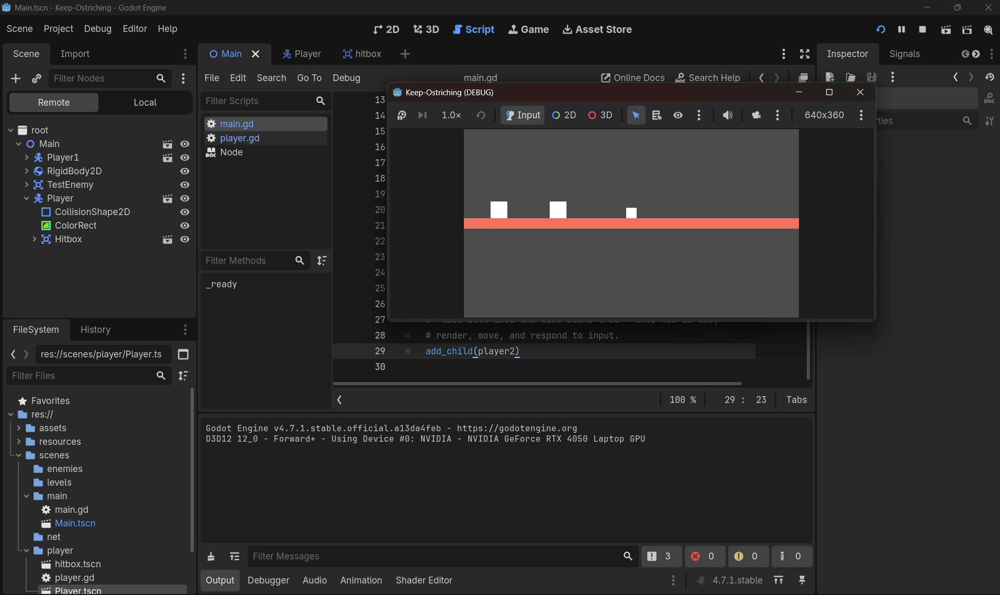

# Bug 1
When I added a child to main scene that inherits properties of Player scene, with the code below:(I had renamed the player scene in main as Player1 and added the child as Player2)
```main.gd
extends Node2D
# Main.gd

# Preloaded once, at compile time — the blueprint, not a live node yet.
var player_scene: PackedScene = preload("res://scenes/player/Player.tscn")

# Script-level (not local to _ready()) so the camera script can read these later.
var player2: CharacterBody2D

func _ready():
	# Create the two live instances from the blueprint.
	player2 = player_scene.instantiate()

	# Position them apart so they don't spawn overlapping.
	player2.position = Vector2(0, 0)

	# Assign each its own input scheme — before add_child(),
	# so it's ready by the time player.gd's own _ready() runs.
	player2.input_source = {
		"left": "p2_left",
		"right": "p2_right",
		"jump": "p2_jump",
		"plunge": "p2_plunge",
		"kick": "p2_kick"
	}

	# Place both into the live scene tree — only now do they
	# render, move, and respond to input.
	add_child(player2)
```
```Player.gd
extends CharacterBody2D
@onready var hitbox = $Hitbox
# Named states instead of magic numbers/strings — readable in the debugger and in match below.
enum State { IDLE, JUMP, PLUNGE, KICK }
var current_state: State = State.IDLE

@export var speed: float = 200.0            # horizontal move speed, px/sec
@export var gravity: float = 1200.0         # downward acceleration, px/sec^2
@export var jump_velocity: float = -400.0   # negative = upward impulse (Y+ is down in Godot)
@export var max_fall_speed: float = 800.0   # terminal velocity cap, prevents runaway fall/tunneling
@export var plunge_explode_threshold: float = 6.0  # seconds of held Plunge before explosion
@export var kick_duration: float = 0.2   # seconds the hitbox stays active per kick

var kick_timer: float = 0.0
var plunge_timer: float = 0.0        # accumulates delta while in PLUNGE; NOT reset on voluntary exit
var ostrich_exploded: bool = false   # one-way flag: once true, physics processing is skipped entirely

# Maps logical action names to actual Input Map action strings, so key rebinds
# only require editing this dictionary, not every Input call below.
var input_source: Dictionary = {}

func _ready() -> void:
	input_source["left"] = "p1_left"
	input_source["right"] = "p1_right"
	input_source["jump"] = "p1_jump"
	input_source["plunge"] = "p1_plunge"
	input_source["kick"] = "p1_kick"

# Horizontal input only — returns -1, 0, or 1 (get_axis interpolates between the two actions).
func _get_horizontal_input() -> float:
	return Input.get_axis(input_source["left"], input_source["right"])

func _physics_process(delta: float) -> void:
	# Explosion is terminal: skip all movement/physics/state logic once it happens.
	# Note move_and_slide() is also skipped in this branch, so the body freezes in place.
	if ostrich_exploded:
		return

	# --- Horizontal: purely input-driven, untouched by gravity or state ---
	velocity.x = _get_horizontal_input() * speed

	# --- Vertical: purely gravity-driven, accumulates every frame ---
	velocity.y += gravity * delta
	velocity.y = min(velocity.y, max_fall_speed)  # cap the fall speed, don't floor it at 0

	# --- Jump: one-shot impulse, only from the ground, only on the press-frame ---
	if Input.is_action_just_pressed(input_source["jump"]) and is_on_floor():
		velocity.y = jump_velocity
		current_state = State.JUMP
		# --- Kick: one-shot trigger, only on the press-frame, not while already kicking/plunging ---
	if Input.is_action_just_pressed(input_source["kick"]) and current_state != State.KICK:
		current_state = State.KICK
		kick_timer = 0.0
		hitbox.monitoring = true
			
	# --- Plunge: state machine branch ---
	match current_state:
		State.PLUNGE:
			# Released down -> exit immediately. plunge_timer is NOT reset here,
			# so re-entering later resumes from wherever it left off.
			if not Input.is_action_pressed(input_source["plunge"]):
				current_state = State.IDLE
			else:
				# Moving sideways while plunging cancels the state this frame.
				# Note: the timer/explosion check below still runs this same frame
				# even after current_state flips to IDLE here — it isn't an early return.
				if Input.is_action_pressed(input_source["right"]) or Input.is_action_pressed(input_source["left"]):
					current_state = State.IDLE

				plunge_timer += delta
				if plunge_timer >= plunge_explode_threshold:
					ostrich_exploded = true
					print("Ostrich exploded!")
					plunge_timer = 0.0
					current_state = State.IDLE
		State.KICK:
			kick_timer += delta
			if kick_timer >= kick_duration:
				print("Kicked!")
				hitbox.monitoring = false
				current_state = State.IDLE
		_:
			# Enter PLUNGE only while grounded and holding down.
			if Input.is_action_pressed(input_source["plunge"]) and is_on_floor():
				current_state = State.PLUNGE

	# Landing while not mid-Plunge resets to IDLE (e.g. clears JUMP once grounded again).
	if is_on_floor() and current_state != State.PLUNGE and current_state != State.KICK:
		current_state = State.IDLE

	move_and_slide()


func _on_hitbox_area_entered(area: Area2D) -> void:
	print(area.name+" Was hit by Ostrichs kick!") # Replace with function body.
```
Image for bug: 

The problem is that both players are controlled by player1s input map. So, it means that main.gd is unable to override the input map for the player2.
## 📝 Debug Session Notes — Day 5 Code-Way Instancing (Full)

**Bug 1 — Players falling through the floor**

> Symptom: "these are just like falled" — both code-instanced players fell indefinitely instead of landing.

- **Cause:** Hardcoded spawn positions (`Vector2(300, 300)` / `Vector2(600, 300)`) were set with no regard for where the floor's collision shape actually sat in `Main.tscn` — the editor-placed player on Days 2–4 had its position tuned by eye against the floor; the code-instanced positions were arbitrary guesses.
- **Fix (self-resolved):** Repositioned spawn coordinates above the actual floor.
- **Lesson:** Editor-placement quietly gives you "position that's already correct relative to the level." Code-instancing makes you responsible for getting that relationship right yourself — nothing checks it for you.

---

**Bug 2 — Both players moving together / P2 controlled by P1's keys**

> Symptom: even after assigning distinct `input_source` dictionaries per instance from `Main.gd`, both players responded to the same (P1) keys.

- **Root cause:** `player.gd`'s `_ready()` contained a hardcoded block:
  ```gdscript
  func _ready() -> void:
      input_source["left"] = "p1_left"
      ...
  ```
  Since `_ready()` always fires *after* `add_child()`, this unconditionally overwrote whatever `Main.gd` had just assigned — for **every** instance, every time — collapsing both players onto identical `p1_*` mappings.
- **Fix:** Delete the hardcoded block. `input_source` must be owned and set **only** by whoever instances the player (`Main.gd`), never defaulted inside `player.gd` itself.
- **Lesson (this is Day 5's actual point):** a script that's meant to generalize across N instances must never write its own defaults into data that's supposed to vary per instance — the moment it does, it silently overrides every caller and the "same script, different data" design breaks.

---

**Bug 3 — `Unexpected identifier "input_source" in class body"`**

> Symptom: syntax error after attempting the Bug 2 fix.

- **Cause:** The `func _ready() -> void:` line was deleted, but the indented body lines underneath it were left behind — in GDScript, bare statements can't sit directly in a script's class body outside any function.
- **Fix:** Either delete the leftover body lines entirely (no `_ready()` needed at all right now), or keep an empty `func _ready() -> void: pass` if you want the function scaffolded for later use.
- **Lesson:** deleting a `func` line without deleting its indented body is a common half-edit — GDScript's indentation-based blocks mean the leftover lines don't just become dead code, they become invalid syntax.

---

**Follow-up doubt on Bug 2 — "If I delete the whole block, I must create/assign player1 in Main.gd too, right?"**

- **Confirmed: yes.** Before the fix, the buggy `_ready()` was silently giving *every* instance a working `p1_*` default — which is why player1 "just worked" without ever being explicitly assigned. That was never real setup for player1; it was a bug that happened to look correct for one instance and broken for every other one.
- **After deleting it:** `input_source` starts as an **empty dictionary** with zero defaults for *every* instance, player1 included. If it's not explicitly assigned, `input_source["left"]` (and the rest) will throw a key-not-found error the first time `_physics_process()` runs.
- **Fix:** `Main.gd` must assign a full `input_source` dictionary to **both** instances — not just player2:
  ```gdscript
  player1.input_source = {
      "left": "p1_left", "right": "p1_right",
      "jump": "p1_jump", "plunge": "p1_plunge", "kick": "p1_kick"
  }
  player2.input_source = {
      "left": "p2_left", "right": "p2_right",
      "jump": "p2_jump", "plunge": "p2_plunge", "kick": "p2_kick"
  }
  ```
- **Open item to verify:** confirm `player1` is actually coming from `Main.gd`'s `.instantiate()`/`add_child()` path and not left over as an editor-placed node from earlier — if it's editor-placed, `Main.gd` has no reference to set its `input_source` on, and it'd need either an `@export var input_source: Dictionary` set in the Inspector, or converting to the code-instanced path like player2.

---

**Net state after all fixes:** `Main.gd` instances two players, explicitly assigns each a distinct, complete `input_source` (player1 included), positions both above the floor, and `player.gd` no longer overwrites any of it. That's the actual pass condition for today's task — P1's keys move only Player1, P2's keys move only Player2, no cross-talk, no silent defaults hiding a broken assignment.

Even a short stretch of the game-mechanics book is worth it before your next session — today's whole arc (Bugs 1–3 plus the follow-up) was really one lesson repeated three ways: state needs exactly one clear owner, and defaults hidden inside a "generic" script are one of the easiest ways to lose track of who that owner is.
